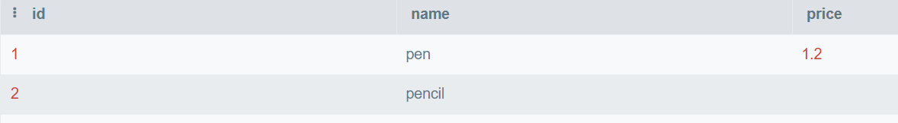
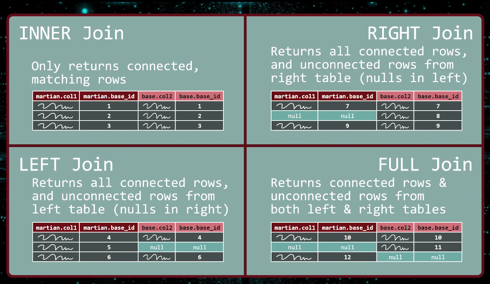
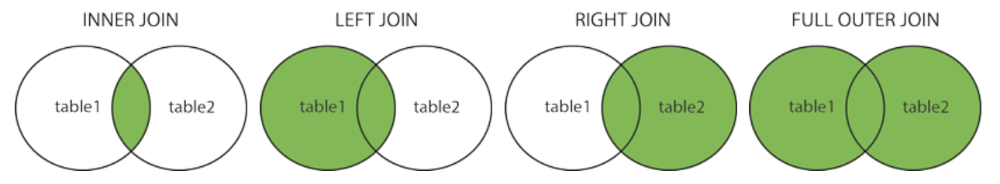

# Scalability of noSQL and SQL

In NoSQL, that object would basically be stored as is, and therefore can reside on a single server as a sort of self-contained object, without any need to join with data from other tables that could reside on other DB servers.

However, with Relational DBs, the post would need to join with comments from the `comments` table, as well as views from the `views` table. This wouldn't be a problem in SQL ~UNTIL~ the DB is broken into shards, in which case 'comment 1' could be on one DB server, while 'comment 2' yet on another DB server. This makes it much more difficult to create the very same object in a RDBMS that has been scaled horizontally than in a NoSQL DB.

# CRUD on SQL

Create Read Update Destroy.

## Create Table

Syntax

```sql
CREATE TABLE table_name (
    column1 datatype,
    column2 datatype,
    column3 datatype,
   ....
);
```

Example:

```sql
CREATE TABLE products (
    id INT NOT NULL,
      name STRING,
      price MONEY,
    PRIMARY KEY (id)
)
```

This snippet creates a new table consisting of 3 rows.

INT, STRING, MONEY are data types in SQL. PRIMARY KEY uniquely identifies each record in a table. NOT NULL forbids an empty entry in this row.

## Insert Data

It is possible to write the `INSERT INTO` statement in two ways:

1. Specify both the column names and the values to be inserted:

```sql
INSERT INTO table_name (column1, column2, column3, ...)
VALUES (value1, value2, value3, ...);
```

2. If you are adding values for all the columns of the table, you do not need to specify the column names in the SQL query. However, make sure the order of the values is in the same order as the columns in the table. Here, the `INSERT INTO` syntax would be as follows:

```sql
INSERT INTO table_name
VALUES (value1, value2, value3, ...);
```

## Read Data

Select Syntax (Access columns)

```sql
SELECT column1, column2, ...
FROM table_name;
```

Where Syntax (Access rows or cells)

```sql
SELECT * FROM Customers
WHERE CustomerID=1;
```

Example

```sql
SELECT name from products
WHERE price = 1.20
```



And this snippet will return "pen".

## Update data

```sql
UPDATE table_name
SET column1 = value1, column2 = value2, ...
WHERE condition;
```

If the where clause is omitted, then the total row will be updated.

## Alter the table

- Add Column

```sql
ALTER TABLE table_name
ADD column_name datatype;
```

- Drop Column

```sql
ALTER TABLE table_name
DROP COLUMN column_name;
```

- Alter Column

```sql
ALTER TABLE table_name
ALTER COLUMN column_name datatype;
```

## Delete rows

```sql
DELETE FROM table_name WHERE condition;
```

```sql
DELETE FROM Customers WHERE CustomerName='Alfreds Futterkiste';
```

## Relationships and Foreign Keys

A `FOREIGN KEY` is a field (or collection of fields) in one table, that refers to the `PRIMARY KEY` in another table.

The table with the foreign key is called the child table, and the table with the primary key is called the referenced or parent table.

It is used to build relationships with the tables.

```sql
CREATE TABLE Orders (
    OrderID int NOT NULL,
    OrderNumber int NOT NULL,
    PersonID int,
    PRIMARY KEY (OrderID),
    FOREIGN KEY (PersonID) REFERENCES Persons(PersonID)
);
```

## Join (inner join)

The join operation put different tables together to make a bigger table containing information from more than one tables. We need to give a column to let the SQL align the rows from different tables. And the way SQL deal with the rows that don't have this aligned columns depends on what kind of join we are using (inner join, left join, etc.). 

Here are the different types of the JOINs in SQL:

- `(INNER) JOIN`: Returns records that have matching values in both tables
- `LEFT (OUTER) JOIN`: Returns all records from the left table, and the matched records from the right table
- `RIGHT (OUTER) JOIN`: Returns all records from the right table, and the matched records from the left table
- `FULL (OUTER) JOIN`: Returns all records when there is a match in either left or right table





```sql
SELECT Orders.OrderID, Customers.CustomerName, Shippers.ShipperName
FROM ((Orders
INNER JOIN Customers ON Orders.CustomerID = Customers.CustomerID)
INNER JOIN Shippers ON Orders.ShipperID = Shippers.ShipperID);
```

# MongoDB

## Installation

https://www.mongodb.com/docs/manual/tutorial/install-mongodb-on-ubuntu/

## MongoDB Service

```bash
sudo systemctl start mongod #start mongodb
sudo systemctl status mongod # mongodb server status
sudo systemctl enable mongod # auto start mongodb after reboot
sudo systemctl stop mongod
sudo systemctl restart mongod
```

## Connect to a MongoDB instance

```shell
mongosh
mongosh "mongodb://localhost:27017"
```

The mongosh (shell of mongodb) is a full functional nodejs environment plus some MongoDB exclusive API. All the database operations can be accessed through some js methods.

| SQL Terms/Concepts                                                         | MongoDB Terms/Concepts                                                                                                                                                                                                                |
| -------------------------------------------------------------------------- | ------------------------------------------------------------------------------------------------------------------------------------------------------------------------------------------------------------------------------------- |
| database                                                                   | [database](https://www.mongodb.com/docs/manual/reference/glossary/#std-term-database)                                                                                                                                                 |
| table                                                                      | [collection](https://www.mongodb.com/docs/manual/reference/glossary/#std-term-collection)                                                                                                                                             |
| row                                                                        | [document](https://www.mongodb.com/docs/manual/reference/glossary/#std-term-document) or [BSON](https://www.mongodb.com/docs/manual/reference/glossary/#std-term-BSON) document                                                       |
| column                                                                     | [field](https://www.mongodb.com/docs/manual/reference/glossary/#std-term-field)                                                                                                                                                       |
| index                                                                      | [index](https://www.mongodb.com/docs/manual/reference/glossary/#std-term-index)                                                                                                                                                       |
| table joins                                                                | [`$lookup`](https://www.mongodb.com/docs/manual/reference/operator/aggregation/lookup/#mongodb-pipeline-pipe.-lookup), embedded documents                                                                                             |
| primary keySpecify any unique column or column combination as primary key. | [primary key](https://www.mongodb.com/docs/manual/reference/glossary/#std-term-primary-key)In MongoDB, the primary key is automatically set to the [_id](https://www.mongodb.com/docs/manual/reference/glossary/#std-term-_id) field. |

## CURDs

## Create database

```mongodb
show dbs // list all the databases
use someDB // set current database to someDB
db // show current database
```

You don't need to create a database explicitly. Use a new database and add entries into this database:

## Insert documents

https://www.mongodb.com/docs/mongodb-shell/crud/insert/

```js
use sample_mflix
db.movies.insertOne(
  {
    title: "The Favourite",
    genres: [ "Drama", "History" ],
    runtime: 121,
    rated: "R",
    year: 2018,
    directors: [ "Yorgos Lanthimos" ],
    cast: [ "Olivia Colman", "Emma Stone", "Rachel Weisz" ],
    type: "movie"
  }
)
```

[`insertOne()`](https://www.mongodb.com/docs/manual/reference/method/db.collection.insertOne/#mongodb-method-db.collection.insertOne) returns a document that includes the newly inserted document's `_id` field value.

If database sample_mflix doesn't exist, Then this operation will create a new database named sample_mflix and create a new document named movies.

To retrieve the inserted document, [read the collection:](https://www.mongodb.com/docs/mongodb-shell/crud/read/#std-label-mongosh-read)

```
db.movies.find( { title: "The Favourite" } )
```

To ensure you return the document you inserted, you can instead query by `_id`.

## Find documents

https://www.mongodb.com/docs/mongodb-shell/crud/read/

https://www.mongodb.com/docs/manual/reference/method/db.collection.find/

```js
db.collection.find(query, projection, options)
```

```js
use sample_mflix
db.movies.find()
```

To return all documents from the `sample_mflix.movies` collection.

```js
use sample_mflix
db.movies.find( { "title": "Titanic" } )
```

To return all movies where the `title` equals `Titanic` from the `sample_mflix.movies` collection.

```js
//SELECT * FROM movies WHERE rated in ("PG", "PG-13")
use sample_mflix
db.movies.find( { rated: { $in: [ "PG", "PG-13" ] } } )
//To return movies which were released in Mexico 
// and have an IMDB rating of at least 7:
use sample_mflix
db.movies.find( { countries: "Mexico", "imdb.rating": { $gte: 7 } } )

//To return movies from the sample_mflix.movies collection 
// which were released in 2010 
// and (either won at least 5 awards or have a genre of Drama):
use sample_mflix
db.movies.find( {
     year: 2010,
     $or: [ { "awards.wins": { $gte: 5 } }, { genres: "Drama" } ]
} )
```

Query operations:

https://www.mongodb.com/docs/manual/reference/operator/query/

## Update

https://www.mongodb.com/docs/mongodb-shell/crud/update/

```js
db.collection.updateOne(filter, update, options)
```

```js
db.collection.updateOne(
   <query>,
   { $set: { status: "D" }, $inc: { quantity: 2 } },
   ...
)
```

```js
use sample_mflix
db.movies.updateOne( { title: "Tag" },
{
  $set: {
    plot: "One month every year, five highly competitive friends
           hit the ground running for a no-holds-barred game of tag"
  }
  { $currentDate: { lastUpdated: true } }
})
//To update the first document in the sample_mflix.movies collection 
// where title equals "Tag"
```

```js
// To update all documents in the sample_airbnb.listingsAndReviews collection 
// to update where security_deposit is less than 100:
use sample_airbnb
db.listingsAndReviews.updateMany(
  { security_deposit: { $lt: 100 } },
  {
    $set: { security_deposit: 100, minimum_nights: 1 }
  }
)
// The update operation uses the  $set
// operator to update the value of the security_deposit field to 100 
// and the value of the minimum_nights field to 1.
```

```js
// To replace the first document from the sample_analytics.accounts 
// collection where account_id: 371138:
db.accounts.replaceOne(
  { account_id: 371138 },
  { account_id: 893421, limit: 5000, products: [ "Investment", "Brokerage" ] }
)
```

Update operations:

https://www.mongodb.com/docs/manual/reference/operator/update/

## Delete

- Delete a field of a document (use updateOne and `$unset`):

```js
db.products.updateOne(
   { sku: "unknown" },
   { $unset: { quantity: "", instock: "" } }
)
```

- Delete one or more document:

```js
db.movies.deleteOne( { cast: "Brad Pitt" } )
db.movies.deleteMany( { title: "Titanic" } )
```

## Relationships

https://www.mongodb.com/docs/manual/core/data-modeling-introduction/

### Embedded Data

Embedded documents capture relationships between data by storing related data in a single document structure. MongoDB documents make it possible to embed document structures in a field or array within a document. These *denormalized* data models allow applications to retrieve and manipulate related data in a single database operation.


### References

References store the relationships between data by including links or *references* from one document to another. Applications can resolve these [references](https://www.mongodb.com/docs/manual/reference/database-references/) to access the related data. Broadly, these are *normalized* data models.


https://www.mongodb.com/docs/manual/reference/database-references/

## MongoDB native driver and ODM (mongoose in node)

The official MongoDB Node. js driver **allows Node.** **js applications to connect to MongoDB and work with data**. The driver features an asynchronous API which allows you to interact with MongoDB using Promises or via traditional callbacks.

```js
try {
   const docs = [
      { "_id": 1, "color": "red"},
      { "_id": 2, "color": "purple"},
      { "_id": 1, "color": "yellow"},
      { "_id": 3, "color": "blue"}
   ];
   const insertManyresult = await collection.insertMany(docs);
   let ids = insertManyresult.insertedIds;
   console.log(`${insertManyresult.insertedCount} documents were inserted.`);
   for (let id of Object.values(ids)) {
      console.log(`Inserted a document with id ${id}`);
   }
} catch(e) {
   console.log(`A MongoBulkWriteException occurred, but there are successfully processed documents.`);
   let ids = e.result.result.insertedIds;
   for (let id of Object.values(ids)) {
      console.log(`Processed a document with id ${id._id}`);
   }
   console.log(`Number of documents inserted: ${e.result.result.nInserted}`);
}
```

The native driver works pretty like the shell commands.

Mongoose is an Object Data Modeling (ODM) library built on top of the MongoDB native driver for Node.js projects.

The other language also have ODM lib, like Morphia in JAVA.

https://www.mongodb.com/docs/drivers/node/current/

[mongoose vs nodejs driver](https://www.mongodb.com/developer/languages/javascript/mongoose-versus-nodejs-driver/)

## mongoose

[Mongoose v6.7.2: Getting Started](https://mongoosejs.com/docs/index.html)

Connect:

```js
const mongoose = require('mongoose');
async function connect() {
    try {
        await mongoose.connect('mongodb://localhost:27017/fruitsDB');
        console.log('Connect successfully');
    } catch (error) {
        console.log('Connect failure');
    }
}
connect().catch(error => console.log(error));
```

This snippet will connect to the fruitsDB database on the local mongodb server.

Since the connect will return a promise, so a short implementation will be:

```js
await mongoose.connect('mongodb://localhost:27017/personDB')
    .then(console.log("Connect successfully"))
    .catch(error => console.log(error));
```

> **This code should work properly, however it doesn't and I don't know why.**

**Because:** You need to put a function that has input into the .then:

```js
await mongoose.connect('mongodb://localhost:27017/personDB')
    .then(()=>console.log("Connect successfully"))
    .catch(error => console.log(error));
```

This code would work properly.

### Mongoose Schema and Model

On one end of the spectrum, we have ODM's like Mongoose, which from the get-go force us into a semi-rigid schema. With Mongoose, you would define a `Schema` object in your application code that maps to a collection in your MongoDB database. The `Schema` object defines the **structure of the documents** in your collection. Then, you need to create a `Model` object out of the schema. The model **is used to interact with the collection**.

For example, let's say we're building a blog and want to represent a blog post. We would first define a schema and then create an accompanying Mongoose model:

```js
const mongoose = require('mongoose');
const blog = new mongoose.Schema({
   title: String,
   slug: String,
   published: Boolean,
   content: String,
   tags: [String],
   comments: [{
       user: String,
       content: String,
       votes: Number
   }]
});

const Blog = mongoose.model('Blog', blog);
```

### Use the model and update collection

```js
// Create a new blog post
const article = new Blog({
   title: 'Awesome Post!',
   slug: 'awesome-post',
   published: true,
   content: 'This is the best post ever',
   tags: ['featured', 'announcement'],
});

// Insert the article in our MongoDB database
await article.save();

// Find a single blog post
Blog.findOne({}, (err, post) => {
   console.log(post);
});
```

Another example:

```js
const mongoose = require('mongoose');
async function connect() {
    try {
        await mongoose.connect('mongodb://localhost:27017/personDB');
        console.log('Connect successfully');
    } catch (error) {
        console.log('Connect failure');
    }
}
connect().catch(error => console.log(error));
const personSchema = new mongoose.Schema({
    name: String,
    age: Number
});
const Person = mongoose.model('Person', personSchema);
const person = new Person({
    name: 'John',
    age: 18
});
person.save().then(() => console.log('Save successfully')).catch(error => console.log(error));
```

This snippet will add a new document {name:'John',age:18} to a collection people in database personDB.

Insert in bulk:

```js
Person.insertMany([person, person2, person3])
.then(() => console.log('Insert successfully'))
.catch(error => console.log(error));
```

Or simply:

```js
Person.insertMany([{
    name: 'John',
    age: 18
}, {
    name: 'Mary',
    age: 20
}])
    .then(() => console.log('Insert successfully'))
    .catch(error => console.log(error));
```

### Read in a database

[Mongoose v6.7.2: Queries](https://mongoosejs.com/docs/queries.html)

- Using model

Anywhere a callback is passed to a query in Mongoose, the callback follows the pattern `callback(error, results)`.

```js
Tank.find({ size: 'small' })
.where('createdDate')
.gt(oneYearAgo)
.exec(callback);
Tank.deleteOne({ size: 'large' }, function (err) {
  if (err) return handleError(err);
  // deleted at most one tank document
});
Tank.updateOne({ size: 'large' }, { name: 'T-90' }, function(err, res) {
  // Updated at most one doc, `res.nModified` contains the number
  // of docs that MongoDB updated
});
// executes, name LIKE john 
// and only selecting the "name" and "friends" fields
await MyModel.find({ name: /john/i }, 'name friends').exec();
```

Mongoose queries are not promises. They have a .then() function for co and async/await as a convenience. However, unlike promises, calling a query's .then() can execute the query multiple times.

```js
Person.find({}, 'name')
.then(persons => { persons.forEach((n) => { console.log(n.name); }) })
.catch(error => console.log(error));
```

Use query builder to chaining conditions:

```js
// With a JSON doc
Person.
  find({
    occupation: /host/,
    'name.last': 'Ghost',
    age: { $gt: 17, $lt: 66 },
    likes: { $in: ['vaporizing', 'talking'] }
  }).
  limit(10).
  sort({ occupation: -1 }).
  select({ name: 1, occupation: 1 }).
  exec(callback);

// Using query builder
Person.
  find({ occupation: /host/ }).
  where('name.last').equals('Ghost').
  where('age').gt(17).lt(66).
  where('likes').in(['vaporizing', 'talking']).
  limit(10).
  sort('-occupation').
  select('name occupation').
  exec(callback);
```

Always remember to close the connection

```js
mongoose.connection.close()
.then(()=>console.log("Connection closed"))
.catch(error => console.log(error));
```

This snippet should be put into the callback/then of the last query/update.

### Data validation

[Mongoose v6.7.2: Validation](https://mongoosejs.com/docs/validation.html)

Mongoose has several built-in validators.

- All [SchemaTypes](https://mongoosejs.com/docs/schematypes.html) have the built-in [required](https://mongoosejs.com/docs/api.html#schematype_SchemaType-required) validator. The required validator uses the [SchemaType's `checkRequired()` function](https://mongoosejs.com/docs/api.html#schematype_SchemaType-checkRequired) to determine if the value satisfies the required validator.
- [Numbers](https://mongoosejs.com/docs/api.html#schema-number-js) have [`min` and `max`](https://mongoosejs.com/docs/schematypes.html#number-validators) validators.
- [Strings](https://mongoosejs.com/docs/api.html#schema-string-js) have [`enum`, `match`, `minLength`, and `maxLength`](https://mongoosejs.com/docs/schematypes.html#string-validators) validators.

Each of the validator links above provide more information about how to enable them and customize their error messages.

```js
const breakfastSchema = new Schema({
  eggs: {
    type: Number,
    min: [6, 'Too few eggs'],
    max: 12
  },
  bacon: {
    type: Number,
    required: [true, 'Why no bacon?']
  },
  drink: {
    type: String,
    enum: ['Coffee', 'Tea'],
    required: function() {
      return this.bacon > 3;
    }
  }
});
const Breakfast = db.model('Breakfast', breakfastSchema);

const badBreakfast = new Breakfast({
  eggs: 2,
  bacon: 0,
  drink: 'Milk'
});
let error = badBreakfast.validateSync();
assert.equal(error.errors['eggs'].message,
  'Too few eggs');
assert.ok(!error.errors['bacon']);
assert.equal(error.errors['drink'].message,
  '`Milk` is not a valid enum value for path `drink`.');

badBreakfast.bacon = 5;
badBreakfast.drink = null;

error = badBreakfast.validateSync();
assert.equal(error.errors['drink'].message, 'Path `drink` is required.');

badBreakfast.bacon = null;
error = badBreakfast.validateSync();
assert.equal(error.errors['bacon'].message, 'Why no bacon?');
```

You can configure the error message for individual validators in your schema. There are two equivalent ways to set the validator error message:

- Array syntax: `min: [6, 'Must be at least 6, got {VALUE}']`
- Object syntax: `enum: { values: ['Coffee', 'Tea'], message: '{VALUE} is not supported' }`

```js
const breakfastSchema = new Schema({
  eggs: {
    type: Number,
    min: [6, 'Must be at least 6, got {VALUE}'],
    max: 12
  },
  drink: {
    type: String,
    enum: {
      values: ['Coffee', 'Tea'],
      message: '{VALUE} is not supported'
    }
  }
});
const Breakfast = db.model('Breakfast', breakfastSchema);

const badBreakfast = new Breakfast({
  eggs: 2,
  drink: 'Milk'
});
const error = badBreakfast.validateSync();
assert.equal(error.errors['eggs'].message,
  'Must be at least 6, got 2');
assert.equal(error.errors['drink'].message, 'Milk is not supported');
```

Validate a new entry without causing the program to crash:

[Mongoose v6.7.2:](https://mongoosejs.com/docs/api/model.html#model_Model-validate)

```js
const Model = mongoose.model('Test', Schema({
  name: { type: String, required: true },
  age: { type: Number, required: true }
});

try {
  await Model.validate({ name: null }, ['name'])
} catch (err) {
  err instanceof mongoose.Error.ValidationError; // true
  Object.keys(err.errors); // ['name']
}
```

### Update/Delete

```js
const res = await Person.updateOne({ name: 'Jean-Luc Picard' }, { ship: 'USS Enterprise' });
res.matchedCount; // Number of documents matched
res.modifiedCount; // Number of documents modified
res.acknowledged; // Boolean indicating everything went smoothly.
res.upsertedId; // null or an id containing a document that had to be upserted.
res.upsertedCount; // Number indicating how many documents had to be upserted. Will either be 0 or 1.

await Character.deleteOne({ name: 'Eddard Stark' }); // returns {deletedCount: 1}
```

### Update use .save()

Use .save() to update is very handy. MongoDB will automatically update the modified field.

However, if you can simply update a document without retrieving the total document, it's ideal for performance's sake to use updateOne().

```js
doc.name = 'foo';
// Mongoose sends an `updateOne({ _id: doc._id }, { $set: { name: 'foo' } })`
// to MongoDB.
await doc.save();
```

### Overwrite?

- [`.updateOne()`](https://mongoosejs.com/docs/api/model.html#model_Model-updateOne)  will not overwrite entire document. 

- Use `replaceOne()` if you want to overwrite an entire document rather than using atomic operators like `$set`.

- Use validator:
  
  ```js
  exports.updateArticle = async (title, newArticle, patch) => {
      if (patch) {
          try {
              return await exports.Article.updateOne({ title: title }, newArticle)
          }
          catch (err) {
              console.log(err);
              throw err;
          }
      }
      else {
          try {
              await exports.Article.validate(newArticle);
              return await exports.Article.replaceOne({ title: title }, newArticle);
          }
          catch (err) {
              console.log(err);
              throw err;
          }
      }
  }
  ```

```js
//use promise:
```

### Use await keyword properly:

```js
async function main() {
    const person = new Person({
        name: 'John',
        age: 20
    });
    await person.save();
    console.log('Person saved');
    let people = await Person.find();
    console.log(people);
    await Person.deleteMany({ name: 'John' }).then(console.log('Deleted all John')).catch(error => console.log(error));
    people = await Person.find();
    console.log(people);
};
main().then(() => console.log('Done')).catch(error => console.log(error));
```

- Do not use await and callback simultaneously 

```js
await BlogPost.updateOne(
  { title: 'Introduction to Promises' }, update, 
  (err, res) => {
    console.log(res);
});
// Because there's both `await` **and** a callback
// this `updateOne()` executes twice
```

### Build relationship

- Embedded Data

```js
const fruitSchema = new mongoose.Schema({
    name: {
        type: String,
        required: [true, 'Name is required']
    },
    rating: Number,
    review: String
});
const personSchema = new mongoose.Schema({
    name: {
        type: String,
        required: [true, 'Name is required']
    },
    age: Number,
    favoriteFruit: fruitSchema
});
const person = new Person({
        name: 'John',
        age: 20,
        favoriteFruit: new Fruit({
            name: 'Apple',
            rating: 9,
            review: 'Great fruit'
        })
    });
await person.save().then(console.log('Person inserted successfully'));
```

Result:

```json
personDB> db.people.find({name: "John"})
[
  {
    _id: ObjectId("6372eb3805b91b61dd928d5a"),
    name: 'John',
    age: 20,
    favoriteFruit: {
      name: 'Apple',
      rating: 9,
      review: 'Great fruit',
      _id: ObjectId("6372eb3805b91b61dd928d59")
    },
    __v: 0
  }
]
```

Update existing documents:

```js
Person.updateMany({ name: 'Mary' }, 
{ favoriteFruit: new Fruit({ name: 'Apple', rating: 9, review: 'Great fruit' }) })
.exec((err, result) => {
        if (err) console.log(err);
        else console.log("Updated successfully");
});
```

Some times the .then method won't function well, use the call back method .exec instead.

### Populate

[Mongoose v6.7.2: Query Population](https://mongoosejs.com/docs/populate.html)

Use the population technique to save references.

Population is the process of automatically replacing the specified paths in the document with document(s) from other collection(s). We may populate a single document, multiple documents, a plain object, multiple plain objects, or all objects returned from a query. Let's look at some examples.

Define schemas:

```js
const fruitSchema = new mongoose.Schema({
    name: {
        type: String,
        required: [true, 'Name is required']
    },
    rating: Number,
    review: String
});
const personSchema = new mongoose.Schema({
    name: {
        type: String,
        required: [true, 'Name is required']
    },
    age: Number,
    favoriteFruit: {
        type: mongoose.Schema.Types.ObjectId,
        ref: 'Fruit', // The name of the model, not the schema
        required: [true, 'Favorite fruit is required']
    }
});
```

Save references:

```js
const fruit = new Fruit({
    _id: new mongoose.Types.ObjectId(),
    name: 'Green Apple',
    rating: 4,
    review: 'Suitable for baking, not for fresh eating'
});

const person = new Person({
    name: 'Sandrine',
    age: 20,
    favoriteFruit: fruit._id
});

await fruit.save().catch(error => console.log(error));
await person.save().catch(error => console.log(error));
```

Populate:

```js
await Person.find({ name: 'Sandrine' })
  .populate('favoriteFruit')
  .then(result => console.log(result))
  .catch(error => console.log(error));
```

Result:

```json
[
  {
    _id: new ObjectId("6372fb4b26d824ae9118460f"),
    name: 'Sandrine',
    age: 20,
    favoriteFruit: {
      _id: new ObjectId("6372fb4b26d824ae9118460d"),
      name: 'Green Apple',
      rating: 4,
      review: 'Suitable for baking, not for fresh eating',
      __v: 0
    },
    __v: 0
  }
]
```

**The populate method won't change the document in the database**.

```js
await Person.find({ name: 'Sandrine' })
    .populate('favoriteFruit')
    .then(result => console.log(result))
    .catch(error => console.log(error));
await Person.find({ name: 'Sandrine' })
    .then(result => console.log(result))
    .catch(error => console.log(error));
```

In this snippet, we do the populate first then perform a find. The second find will return the unpopulated document:

```json
[
  {
    _id: new ObjectId("6372fcc292f264eaf81401e0"),
    name: 'Sandrine',
    age: 20,
    favoriteFruit: new ObjectId("6372fcc292f264eaf81401de"),
    __v: 0
  }
]
```

### Retrieve an Array

```js
const listSchema = new mongoose.Schema({
    name: {
        type: String,
        required: true
    },
    date: {
        type: Date,
    },
    items: [{
        type: mongoose.Schema.Types.ObjectId,
        ref: "Item",
        required: true
    }]
});

async function renderListItem(listName) {
    let listItem = [];
    await List.findOne({ name: listName })
        .populate("items")
        .then(result => {
            if (result) {
                result.items.forEach(item => {
                    listItem.push(item.content);
                });
            };
        })
        .catch((err) => { console.log(err) });
    return listItem;
}
```

The array type in the schema is not in form of Javascript array when retrieved back . You can use foreach to dump the array in to a real Javascript array. However, the thing return can be used as a normal array by using .length/forEach/[index], so it's totally to return the object like this:

```js
async function renderListItem(listName) {
    return (await List.findOne({ name: listName })
        .populate("items")
        .catch((err) => { console.log(err) }))
        .items; //The .items is a mongoose Proxy object, 
                //but it can be used like an array
}
```

Another example, these two functions return different types but they both work.

```js
async function getLists() {
    let lists = [];
    await List.find()
        .then(result => {
            if (result) {
                result.forEach(list => {
                    lists.push({ name: list.name, realName: list.realName });
                });
            };
        })
        .catch((err) => { console.log(err) });
    return lists; //This is a real js array
}

async function getLists() {
    return await List.find().catch((err) => { console.log(err) });
    //returned an array of model
    //but it can be used like an array of blog list
}
```

### Delete element from an array

```js
const listSchema = new mongoose.Schema({
    name: {
        type: String,
        required: true
    },
    date: {
        type: Date,
    },
    items: [{
        type: mongoose.Schema.Types.ObjectId,
        ref: "Item",
        required: true
    }]
});
```

The items field is an array of references.

It looks like:

```json
db.lists.findOne({ name: 'monday' })
{
  _id: ObjectId("63732a373a14d82e8c3c16d1"),
  name: 'monday',
  items: [
    ObjectId("63732ab23a14d82e8c3c16d5"),
    ObjectId("63732b3e3a14d82e8c3c16dc"),
    ObjectId("63732c2e221f226d1c6ca9df"),
    ObjectId("63732c64221f226d1c6ca9e8"),
    ObjectId("63733821fec1434885cabea4"),
    ObjectId("63733824fec1434885cabeab"),
    ObjectId("63733844fec1434885cabec7")
  ],
  __v: 0
}
```

So if we want to delete an item from items, write code:

```js
List.updateOne({ name: 'monday' }, 
{$pull:
  {items:{ $eq:new mongoose.Types.ObjectId("hexString")}}
}
)
```

And if we want to delete an element from a document like this:

```js
user = {
    "userId" : "myId",
    "connections":
    [{
        "dateConnectedUnix": 1334567891,
        "isActive": true
    }, {
        "dateConnectedUnix": 1334567893,
        "isActive": false
    }]
}
```

We can write:

```js
db.xxx.updateOne({userID:'myID'},
{$pull:
  {connections:{"dateConnectedUnix": 133456}
}
);
```
