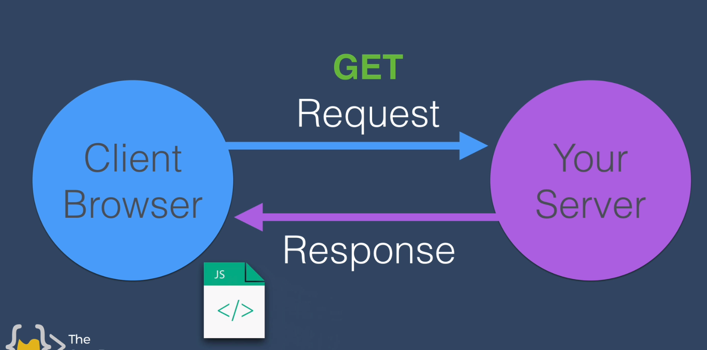
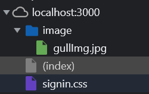

# What Can Node.js Do?

- Node.js can generate dynamic page content
- Node.js can create, open, read, write, delete, and close files on the server
- Node.js can collect form data
- Node.js can add, delete, modify data in your database

# File access

## Copy file

```js
const fs = require("fs");
fs.copyFileSync("file1","file2");
```

- require method imports a module called "fs"

## Modules

- Import modules
  
  ```js
  const mod = require("module name");
  ```
  
  The node will look for the module in the current directory.

- Install modules
  
  ```bash
  npm install <module name> [-g]
  ```
  
  This command will install the module in the current directory. If -g is added, then it will install the module globally.

# npm initialize

- `npm init`

After initializing the module, each time we install a 3rd part module to our work directory, npm will automatically add the 3rd part modules to the dependency list of our module.

# Express app

## Listening

```js
const express = require('express');
const app = express();
app.listen(3000, () => console.log('Server is running on port 3000'));
```

# Route

[Express routing](https://expressjs.com/en/guide/routing.html)



```js
const { response } = require('express');
const express = require('express');
const app = express();
app.listen(3000, () => console.log('Server is running on port 3000'));
app.get("/", (request, response) => {
    console.log(request);
    response.send("<h1>Hello World</h1>");
})
```

The get method of app handles the get request from the browser. "/" is the requested path, and what follows is the call back function.

## Multi route:

[Express routing](https://expressjs.com/en/guide/routing.html)

```js
app.get("/", (request, response) => {
    console.log(request);
    response.send("<h1>Hello World</h1>");
})
app.get("/contact", (res, req) => {
    req.send("Contact me at: ");
})
```

## SendFile

```js
app.get("/", (req, res) => {
    res.sendFile(__dirname + "/index.html");
});
```

sendFile method need a absolute path. So use `__dirname` to resolve the current path.

## Parse the POST request

- Use a middle ware called `body-parser`. 

Use the `body-parser`:

```js
const express = require('express');
const bodyParser = require('body-parser');
const app = express();
app.use(bodyParser.urlencoded({ extended: true }));
```

Parse the POSTed form:

```js
app.post("/", (req, res) => {
    console.log(req.body);
    let num1 = Number(req.body.num1);
    let num2 = Number(req.body.num2);
    let result = num1 + num2;
    res.send("The result of the calculation is " + result);
});
```

The HTML form:

```html
<form action="/" method="post">
  <input type="text" name="num1" placeholder="First Number">
  <input type="text" name="num2" placeholder="Second Number">
  <button type="submit" >Calculate</button>
</form>
```

## nodemon

nodemon is a tool that helps develop Node.js based applications by automatically restarting the node application when file changes in the directory are detected.

# Port already in use

[How to kill a process on a port on ubuntu - Stack Overflow](https://stackoverflow.com/questions/9346211/how-to-kill-a-process-on-a-port-on-ubuntu)

- ```bash
  pkill node
  sudo kill -9 $(sudo lsof -t -i:3000)
  ```

# API

- Endpoint 

- Paths

- Parameters

- Authentication 

## Parameters

```http
https://endpoint.com/path1/path2/?query1=xxx&query2=yyy
```

The part `?query1=xxx&query2=yyy` is the so called parameters.

[Get Query Strings and Parameters in Express.js](https://stackabuse.com/get-query-strings-and-parameters-in-express-js/)

## Authentication

- Use a key parameter.

## Make a get request in Node.js

Use the native node module http/https.

```js
const https = require("https");
https.get(url, function (api_res) {
    console.log(api_res);
});
```

The naming logic of native https module and express is different. https.get means sending a get request to an external server, and app.get means handling a get request sent to our server.

## Make a post request in Node

[HTTP | Node.js v19.0.1 Documentation](https://nodejs.org/api/http.html#httprequestoptions-callback)

```js
const http = require('node:http');

const postData = JSON.stringify({
  'msg': 'Hello World!'
});

const options = {
  hostname: 'www.google.com',
  port: 80,
  path: '/upload',
  method: 'POST',
  headers: {
    'Content-Type': 'application/json',
    'Content-Length': Buffer.byteLength(postData)
  }
};

const req = http.request(options, (res) => {
  console.log(`STATUS: ${res.statusCode}`);
  console.log(`HEADERS: ${JSON.stringify(res.headers)}`);
  res.setEncoding('utf8');
  res.on('data', (chunk) => {
    console.log(`BODY: ${chunk}`);
  });
  res.on('end', () => {
    console.log('No more data in response.');
  });
});

req.on('error', (e) => {
  console.error(`problem with request: ${e.message}`);
});

// Write data to request body
req.write(postData);
req.end();
```

## Parsing JSON

```js
https.get(url, function (api_res) {
       api_res.on("data", (data) => {
       const weatherData = JSON.parse(data);
       const temp = weatherData.main.temp;
       console.log(temp);
   });
});
```

# Hosting a website

## How to send auxiliary files

Ref: [javascript - How do I send multiple files with expressjs? - Stack Overflow](https://stackoverflow.com/questions/62615690/how-do-i-send-multiple-files-with-expressjs/62616345#62616345?newreg=9507592bfa0b4f428d9376d8c473a9d7)

If we send back an HTML file and the browser reads through the code. When the browser read the 

```html
<link href="signin.css" rel="stylesheet" />

```

it will send other two get requests:

```bash
GET currentpath/signin.css
GET currentpath/image/gullImg.jpg
```

We can write another backend code to send back those two files like this:

```js
app.get("/", (req, res) => {
    res.sendFile(`${__dirname}/signup.html`);
})
app.get("/:filename", (req, res) => {
    res.sendFile(`${__dirname}/${req.params.filename}`);
})
app.get("/:path1/:path2", (req, res) => {
    res.sendFile(`${__dirname}/${req.params.path1}/${req.params.path2}`);
})
```

And the browser will organize the files as:



So the css and assets are organized as if they are in the local file.

> This is how web pages work. The browser makes a separate http request for each resource in the file (scripts, images, CSS files, etc...) and your server needs to separately respond to each of those http requests and send the appropriate resource.
> 
> In Express, these requests for static resources are typically handled with `express.static()` where one line of middleware can handle the serving of many files within a directory hierarchy.
> 
> Note: It is generally advisable not to use path relative URLs for your static resources because the browser will combine those path relative URLs with the path of the current web page and this will make it hard to use the same static resources in different web pages on your site. Instead, start your static URLs with a leading `/` so they generate a constant URL request to your server no matter which page they are used in.

All the above works can be handled with the express static middleware static.

Add code:

```js
app.use(express.static("public"));
```

Then express will find all the file requested in ./public. 

## A useable form

```html
<form action="/" method="post">
        
        <h1 class="h3 mb-3 fw-normal">Signup to my Newsletter</h1>

        <div class="form-floating">
          <input
            type="text"
            id="FirstNameInput"
            class="form-control top"
            placeholder="First Name"
            name="firstName"
            required
            autofocus
          />
          <label for="FirstNameInput">First Name</label>
        </div>
        <div class="form-floating">
          <input
            type="text"
            class="form-control middle"
            id="LastNameInput"
            placeholder="Last Name"
            name="lastName"
          />
          <label for="LastNameInput">Last Name</label>
        </div>
        <div class="form-floating">
          <input
            type="email"
            class="form-control bottom"
            id="emailInput"
            placeholder="Email"
            name="email"
            required
          />
          <label for="emailInput">Email Input</label>
        </div>

        <button class="w-100 btn btn-lg btn-primary" type="submit">
          Sign Up
        </button>
        <p class="mt-5 mb-3 text-muted">© Tieyun</p>
      </form>
```

## Deploy to Heroku

1. Change listening port to `process.env.PORT || 3000`

2. Connect the Github repo to Heroku

3. add start script to package.json:
   
   ```js
   "scripts": {
       "start": "node app.js",
       "test": "echo \"Error: no test specified\" && exit 1"
   }
   ```

# EJS templates

[Using EJS with Express · mde/ejs Wiki · GitHub](https://github.com/mde/ejs/wiki/Using-EJS-with-Express)

## Output Tag `<%= %>`

EJS is a superset of HTML. It leaves some variables in an HTML file that can be changed on the fly. EJS can be incorporated into express as a render engine.

```ejs
<h1>It's <%= kindOfDay %>  </h1>
```

```js
res.render("list", { kindOfDay: today });
```

## Scriptlet tag `<% %>`

Used the scriptlet tag to wrap non-html code, allowing to add some control flow to HTML.

```js
<% if (kindOfDay === 6 || kindOfDay === 7) { %>
    <h1>Yay! It's the weekend!</h1>
<% } else { %>
    <h1>Boo! I have to go to work!</h1>
<% } %> 
```

## Rendering multiple elements

```html
<% for(var listItem of newListItem){ %>
<li><%= listItem %></li>
<% } %>
```

```js
res.render("list", {
 kindOfDay: today.toLocaleDateString("en-US", options), 
 newListItem: items }
);
```

When passing the items array into ejs file, the renderer will loop through the array and create an li element for each element in the array.

## Redirect post request

Add a EJS value field to button:

```ejs
<button type="submit" name="list" value= <%=listTitle %> >+</button>
```

The form will include a list field when it is posted to the default home route. Then we can check this field to decide our actions.

```js
app.get("/work", (req, res) => {
    res.render("list", { listTitle: "Work List", newListItem: workItems });
});

app.post("/", (req, res) => {
    if (req.body.list === "Work") {
        workItems.push(req.body.newItem);
        res.redirect("/work");
    } else {
        items.push(req.body.newItem);
        res.redirect("/");
    }
})
```

## Layouts

```ejs
<%- include('header'); -%>
<h1>
  Title
</h1>
<p>
  My page
</p>
<%- include('footer'); -%>
```

Write two files: header.ejs and footer.ejs in folder views.

# Misc

## Format date string

[Date.prototype.toLocaleDateString() - JavaScript | MDN](https://developer.mozilla.org/en-US/docs/Web/JavaScript/Reference/Global_Objects/Date/toLocaleDateString)

```js
var options = { weekday: 'long', year: 'numeric', month: 'long', day: 'numeric' };
var today  = new Date();

console.log(today.toLocaleDateString("en-US")); // 9/17/2016
console.log(today.toLocaleDateString("en-US", options)); // Saturday, September 17, 2016
```

## Export a module

```js
module.exports = getDate;
function getDate() {
    let options = {
        weekday: "long",
        day: "numeric",
        month: "long"
    }
    let today = new Date();
    return today.toLocaleDateString("en-US", options);
}
```

Use this module:

```js
const date = require(__dirname + "/date.js");
var day = date();
```

We should use the absolute path to require a local module.

The code inside the module will be executed when we require a module 

## Export multiple things:

```js
module.exports = { getDate: getDate, getDay: getDay };
```

We can return an object containing multiple methods and values.

And we can simply do like this:

```js
module.exports.getDate = getDate;
module.exports.getDay = getDay;
```

It will do the same thing.

## More succinct implementation

```js
exports.getDate = () => {
    let options = {
        weekday: "long",
        day: "numeric",
        month: "long"
    }
    let today = new Date();
    return today.toLocaleDateString("en-US", options);
}
exports.getDay = () => {
    let options = {
        weekday: "long"
    }
    let today = new Date();
    return today.toLocaleDateString("en-US", options);
}
```

## return status code:

```js
res.status(404).send('Not Found');
```

## lodash

[Lodash Documentation](https://lodash.com/docs/4.17.15)

```js
const _ = require("lodash");


_.lowerCase('--Foo-Bar--');
// => 'foo bar'

_.lowerCase('fooBar');
// => 'foo bar'

_.lowerCase('__FOO_BAR__');
// => 'foo bar'
```

- Resolve the hyphened url

```js

```
