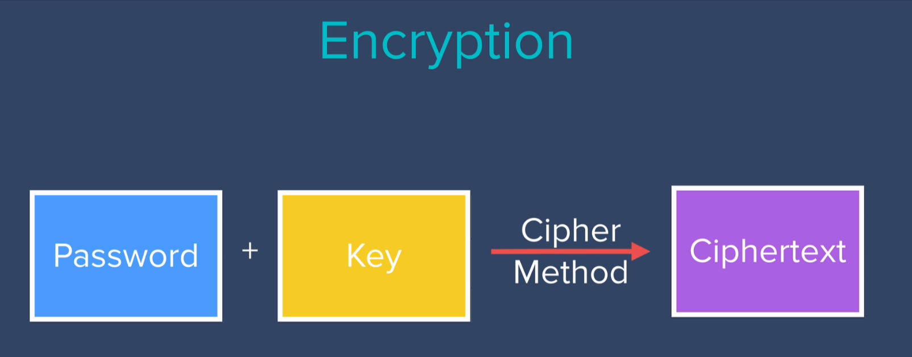
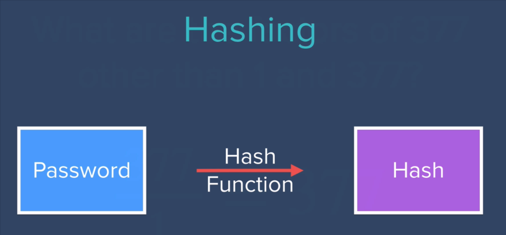
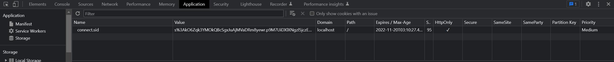
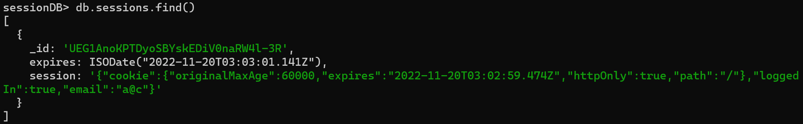

# Database encryption

## Middleware mongoose-encryption

[GitHub - joegoldbeck/mongoose-encryption: Simple encryption and authentication plugin for Mongoose](https://github.com/joegoldbeck/mongoose-encryption)

It works as a plugin of mongoose schema.

Encodekey and Signingkey:

```js
var mongoose = require('mongoose');
var encrypt = require('mongoose-encryption');

var userSchema = new mongoose.Schema({
    name: String,
    age: Number
    // whatever else
});

// Add any other plugins or middleware here. For example, middleware for hashing passwords

var encKey = process.env.SOME_32BYTE_BASE64_STRING;
var sigKey = process.env.SOME_64BYTE_BASE64_STRING;

userSchema.plugin(encrypt, { encryptionKey: encKey, signingKey: sigKey });
// This adds _ct and _ac fields to the schema, as well as pre 'init' and pre 'save' middleware,
// and encrypt, decrypt, sign, and authenticate instance methods

User = mongoose.model('User', userSchema);
```

One secret key:

```js
var secret = process.env.SOME_LONG_UNGUESSABLE_STRING;
userSchema.plugin(encrypt, { secret: secret });
```

And you're all set. `find` works transparently (though **you cannot query fields that are encrypted**) and you can make `New` documents as normal. `findOne`, `findById`, etc..., as well as `save` and `create` also all work as normal. `update` will work fine on unencrypted and unauthenticated fields, but **will not work correctly if encrypted or authenticated fields are involved.**

How to generate long random string:

```js
openssl rand -base64 32
openssl rand -base64 64
```

Only encrypt certain fields:

```js
// exclude age from encryption, still encrypt name. _id will also remain unencrypted
userSchema.plugin(encrypt, { encryptionKey: encKey, signingKey: sigKey, excludeFromEncryption: ['age'] });
// encrypt age regardless of any other options. name and _id will be left unencrypted
userSchema.plugin(encrypt, { encryptionKey: encKey, signingKey: sigKey, encryptedFields: ['age'] });
```

### Getting Started with an Existing Collection

If you are using mongoose-encryption on an empty collection, you can immediately begin to use it as above. To use it on an existing collection, you'll need to either run a migration or use less secure options.

**The Secure Way**

To prevent tampering of the documents, each document is required by default to have a signature upon `find`. The class method `migrateToA()` encrypts and signs all documents in the collection. This should go without saying, but **backup your database** before running the migration below.

```js
// This should be run in a separate migration script
userSchema.plugin(encrypt.migrations, { .... });
User = mongoose.model('User', userSchema);
User.migrateToA(function(err){
    if (err){ throw err; }
    console.log('Migration successful');
});
```

Following the migration, you can use the plugin as above.

# Environment Variables

[GitHub - motdotla/dotenv: Loads environment variables from .env for nodejs projects.](https://github.com/motdotla/dotenv)

# Hashing Password

## Problems of encryption



If the key is compromised then the password is in danger.



## Use crypto module

```js
const crypto = require('crypto');
const passwordHash = crypto.createHash('sha256').update(password).digest('base64');
```

## Venerability of Hash

If the password is leaked and used in multiple places, then with the same hash the password in the other website is also leaked.

# Salting


## Salting rounds:

password + salt1 -> hash1 + salt2 -> hash2 + ... + saltn -> hash n Done!

## bcrypt

Besides incorporating a [salt](https://en.wikipedia.org/wiki/Salt_(cryptography) "Salt (cryptography)") to protect against [rainbow table](https://en.wikipedia.org/wiki/Rainbow_table "Rainbow table") attacks, bcrypt is an adaptive function: over time, the iteration count can be increased to make it slower, so it remains resistant to [brute-force search](https://en.wikipedia.org/wiki/Brute-force_search "Brute-force search") attacks even with increasing computation power.

[GitHub - kelektiv/node.bcrypt.js: bcrypt for NodeJs](https://github.com/kelektiv/node.bcrypt.js)

## Usage

### async (recommended)

```js
const bcrypt = require('bcrypt');
const saltRounds = 10;
const myPlaintextPassword = 's0/\/\P4$$w0rD';
const someOtherPlaintextPassword = 'not_bacon';
```

#### To hash a password:

Technique 1 (generate a salt and hash on separate function calls):

```js
bcrypt.genSalt(saltRounds, function(err, salt) {
    bcrypt.hash(myPlaintextPassword, salt, function(err, hash) {
        // Store hash in your password DB.
    });
});
```

Technique 2 (auto-gen a salt and hash):

```js
bcrypt.hash(myPlaintextPassword, saltRounds, function(err, hash) {
    // Store hash in your password DB.
});
```

Note that both techniques achieve the same end-result.

#### To check a password:

```js
// Load hash from your password DB.
bcrypt.compare(myPlaintextPassword, hash, function(err, result) {
    // result == true
});
bcrypt.compare(someOtherPlaintextPassword, hash, function(err, result) {
    // result == false
});
```

### with promises

bcrypt uses whatever `Promise` implementation is available in `global.Promise`. NodeJS >= 0.12 has a native `Promise` implementation built in. However, this should work in any Promises/A+ compliant implementation.

Async methods that accept a callback, return a `Promise` when callback is not specified if Promise support is available.

```js
bcrypt.hash(myPlaintextPassword, saltRounds).then(function(hash) {
    // Store hash in your password DB.
});
```

```js
// Load hash from your password DB.
bcrypt.compare(myPlaintextPassword, hash).then(function(result) {
    // result == true
});
bcrypt.compare(someOtherPlaintextPassword, hash).then(function(result) {
    // result == false
});
```

This is also compatible with `async/await`

```js
async function checkUser(username, password) {
    //... fetch user from a db etc.

    const match = await bcrypt.compare(password, user.passwordHash);

    if(match) {
        //login
    }

    //...
}
```

# Cookie and Session

[Understanding Cookies and Implementing them in Node.js | Engineering Education (EngEd) Program | Section](https://www.section.io/engineering-education/what-are-cookies-nodejs/)

[language agnostic - What are sessions? How do they work? - Stack Overflow](https://stackoverflow.com/a/3804387/20483470)

[Session Management in Node.js using ExpressJS and Express Session | Engineering Education (EngEd) Program | Section](https://www.section.io/engineering-education/session-management-in-nodejs-using-expressjs-and-express-session/)

## Web sessions vs. cookies

Web sessions are frequently compared to (and confused with) cookies. Although both cookies and web sessions store information about a user, their functions are different in practice.

Cookies are text files that are used to authenticate and track visitors to a website, and that are stored only on the user's machine. The lifespan of a cookie is typically much longer than that of a web session, on the order of months or even years. Cookies are how websites store long-term user information that should be preserved: for example, automatically logging the user in when arriving at the website, or automatically filling in a form with the user's details.

By contrast, web sessions are meant to store information about only the user's most recent activities. Web sessions are stored on the server rather than the client, which helps prevent malicious users from editing them. Both web sessions and cookies can be used in combination to keep track of users' long-term and short-term behavior.

## How session works:

When the client makes a login request to the server, the server will create a session and store it on the server-side. When the server responds to the client, it sends a **cookie**. This cookie will contain the session’s unique id stored on the server, which will now be stored on the client. This **cookie will be sent on every request to the server**.

We use this session ID and look up the session saved in the database or the session store to maintain a one-to-one match between a session and a cookie. This will make HTTP protocol connections stateful.

## Express cookie

[Set-Cookie - HTTP | MDN](https://developer.mozilla.org/en-US/docs/Web/HTTP/Headers/Set-Cookie)

Basic usage example:

```js
app.use(cookieParser());
app.get('/setcookie', (req, res) => {
    res.cookie(`Cookie token name`,`encrypted cookie string Value`);
    res.send('Cookie have been saved successfully');
});
app.get('/getcookie', (req, res) => {
    //show the saved cookies
    console.log(req.cookies)
    res.send(req.cookies);
/*
{
  "Cookie token name": "encrypted cookie string Value"
}*/
});

app.get('/setcookie_secure', (req, res) => {
    res.cookie(`Cookie token name`,`encrypted cookie string Value`,{
        maxAge: 5000,
        // expires works the same as the maxAge
        expires: new Date('01 12 2021'),
        secure: true,
        httpOnly: true,
        sameSite: 'lax'
    });
    res.send('Cookie have been saved successfully');
});

app.get('/deletecookie', (req, res) => {
    res.clearCookie(`Cookie token name`);
    res.send('Cookie has been deleted successfully');
});
```

## Express session:

[GitHub - expressjs/session: Simple session middleware for Express](https://github.com/expressjs/session#readme)

Use Express session step by step:

Package setup:

```bash
npm install express-session
```

Do not use cookie-parser anymore!

### Basic setup of express session:

```js
const session = require('express-session');
app.use(session({
    secret: process.env.SECRET,
    resave: false,
    saveUninitialized: false
}));
```

#### Options:

##### cookie

Settings object for the session ID cookie. The default value is `{ path: '/', httpOnly: true, secure: false, maxAge: null }`.

The maxAge field is used to control the expiry time of the session:

```js
const express = require('express')
const session = require('express-session')
 // Use the session middleware
 const app = express()
 app.use(session({
  secret: 'its my secret',
  cookie: { maxAge: 60000 }, // value of maxAge is defined in milliseconds. 
  resave: false,
  rolling: false,
  saveUninitialized: true
}))
```

##### resave

Forces the session to be saved back to the session store, even if the session was never modified during the request. Depending on your store this may be necessary, but it can also create race conditions where a client makes two parallel requests to your server and changes made to the session in one request may get overwritten when the other request ends, even if it made no changes (this behavior also depends on what store you're using).

The default value is `true`, but using the default has been deprecated, as the default will change in the future. Please research into this setting and choose what is appropriate to your use-case. Typically, you'll want `false`.

How do I know if this is necessary for my store? The best way to know is to check with your store if it implements the `touch` method. If it does, then you can safely set `resave: false`. If it does not implement the `touch` method and your store sets an expiration date on stored sessions, then you likely need `resave: true`.

##### rolling

Force the session identifier cookie to be set on every response. The expiration is reset to the original [`maxAge`](https://github.com/expressjs/session#cookiemaxage), resetting the expiration countdown.

The default value is `false`.

With this enabled, the session identifier cookie will expire in [`maxAge`](https://github.com/expressjs/session#cookiemaxage) since the last response was sent instead of in [`maxAge`](https://github.com/expressjs/session#cookiemaxage) since the session was last modified by the server.

This is typically used in conjuction with short, non-session-length [`maxAge`](https://github.com/expressjs/session#cookiemaxage) values to provide a quick timeout of the session data with reduced potential of it occurring during on going server interactions.

##### saveUninitialized

Forces a session that is "uninitialized" to be saved to the store. A session is uninitialized when it is new but not modified. Choosing `false` is useful for implementing login sessions, reducing server storage usage, or complying with laws that require permission before setting a cookie. Choosing `false` will also help with race conditions where a client makes multiple parallel requests without a session.

The default value is `true`, but using the default has been deprecated, as the default will change in the future. Please research into this setting and choose what is appropriate to your use-case.

##### secret

**Required option**

This is the secret used to sign the session ID cookie. This can be either a string for a single secret, or an array of multiple secrets. If an array of secrets is provided, only the first element will be used to sign the session ID cookie, while all the elements will be considered when verifying the signature in requests. The secret itself should be not easily parsed by a human and would best be a random set of characters. A best practice may include:

- The use of environment variables to store the secret, ensuring the secret itself does not exist in your repository.
- Periodic updates of the secret, while ensuring the previous secret is in the array.

Using a secret that cannot be guessed will reduce the ability to hijack a session to only guessing the session ID (as determined by the `genid` option).

Changing the secret value will invalidate all existing sessions. In order to rotate the secret without invalidating sessions, provide an array of secrets, with the new secret as first element of the array, and including previous secrets as the later elements.

##### store

The session store instance, defaults to a new `MemoryStore` instance. The default store should not be used in a production environment.

- The MongoDB native nodejs driver based store [connect-mongo](https://www.npmjs.com/package/connect-mongo):

```js
const session = require('express-session');
const MongoStore = require('connect-mongo');

app.use(session({
  secret: 'foo',
  store: MongoStore.create({ 
     mongoUrl: 'mongodb://localhost/test-app' 
  })
}));
```

- The redis based store [connect-redis](https://www.npmjs.com/package/connect-redis) seems to have impressive performance. Redis is implemented in RAM, and it's extremely suitable for small scale data storage, which is ideal for a session storage.
  
  

### req.session

To store or access session data, simply use the request property `req.session`, which is (generally) serialized as JSON by the store, so nested objects are typically fine.

**You can add and retrieve whatever field you want to this object!**

Example:

```js
// Use the session middleware
app.use(session({ secret: 'keyboard cat', cookie: { maxAge: 60000 }}))

// Access the session as req.session
app.get('/', function(req, res, next) {
  if (req.session.views) {
    req.session.views++
    res.setHeader('Content-Type', 'text/html')
    res.write('<p>views: ' + req.session.views + '</p>')
    res.write('<p>expires in: ' + (req.session.cookie.maxAge / 1000) + 's</p>')
    res.end()
  } else {
    req.session.views = 1
    res.end('welcome to the session demo. refresh!')
  }
})
```

#### Session.regenerate(callback)

To regenerate the session simply invoke the method. Once complete, a new SID and `Session` instance will be initialized at `req.session` and the `callback` will be invoked.

```js
req.session.regenerate(function(err) {
  // will have a new session here
})
```

#### Session.destroy(callback)

Destroys the session and will unset the `req.session` property. Once complete, the `callback` will be invoked.

#### Session.reload(callback)

Reloads the session data from the store and re-populates the `req.session` object. Once complete, the `callback` will be invoked.

#### Session.save(callback)

Save the session back to the store, replacing the contents on the store with the contents in memory (though a store may do something else--consult the store's documentation for exact behavior).

This method is automatically called at the end of the HTTP response if the session data has been altered (though this behavior can be altered with various options in the middleware constructor). Because of this, typically this method does not need to be called.

There are some cases where it is useful to call this method, for example, redirects, long-lived requests or in WebSockets.

#### Session.touch()

Updates the `.maxAge` property. Typically this is not necessary to call, as the session middleware does this for you.

### req.session.id

Each session has a unique ID associated with it. This property is an alias of [`req.sessionID`](https://github.com/expressjs/session#reqsessionid-1) and cannot be modified. It has been added to make the session ID accessible from the `session` object.

### req.session.cookie

Each session has a unique cookie object accompany it. This allows you to alter the session cookie per visitor. For example we can set `req.session.cookie.expires` to `false` to enable the cookie to remain for only the duration of the user-agent.

#### Cookie.maxAge

Alternatively `req.session.cookie.maxAge` will return the time remaining in milliseconds, which we may also re-assign a new value to adjust the `.expires` property appropriately. The following are essentially equivalent

```js
var hour = 3600000
req.session.cookie.expires = new Date(Date.now() + hour)
req.session.cookie.maxAge = hour
```

For example when `maxAge` is set to `60000` (one minute), and 30 seconds has elapsed it will return `30000` until the current request has completed, at which time `req.session.touch()` is called to reset `req.session.cookie.maxAge` to its original value.

```js
req.session.cookie.maxAge // => 30000
```

#### Cookie.originalMaxAge

The `req.session.cookie.originalMaxAge` property returns the original `maxAge` (time-to-live), in milliseconds, of the session cookie.

### req.sessionID

To get the ID of the loaded session, access the request property `req.sessionID`. This is simply a read-only value set when a session is loaded/created.


### Use express session to authenticate user

```js
require('dotenv').config();
const express = require('express');
const bodyParser = require('body-parser');
const session = require('express-session');
const MongoStore = require('connect-mongo');
const ejs = require('ejs');
const db = require('./dbUtils.js');
const app = express();

app.set('view engine', 'ejs');
app.use(bodyParser.urlencoded({ extended: true }));
app.use(express.json());
app.use(express.static('public'));
app.use(session({
    secret: process.env.SECRET,
    resave: false,
    saveUninitialized: false,
    cookie: {
        //60 seconds
        maxAge: 60000
    },
    store: MongoStore.create({ mongoUrl: 'mongodb://127.0.0.1:27017/sessionDB' })
}));


app.route("/")
    .get((req, res) => {
        res.render('home');
    });
app.route("/login")
    .get((req, res) => {
        if (req.session.loggedIn)
            res.redirect('secrets');
        else
            res.render('login');
    })
    .post((req, res) => {
        const email = req.body.username;
        const password = req.body.password;
        db.findUser(email).then(user => {
            if (user) {
                if (user.password === password) {
                    req.session.loggedIn = true;
                    req.session.email = email;
                    res.redirect('/secrets');
                }
                else
                    res.redirect('/login');
            }
            else
                res.redirect('/login');
        });
    });


app.route("/register")
    .get((req, res) => {
        if (req.session.loggedIn)
            res.redirect('/secrets');
        else
            res.render('register');
    })
    .post((req, res) => {
        const email = req.body.username;
        const password = req.body.password;
        db.findUser(email).then(user => {
            if (user)
                res.redirect('login');
            else {
                db.addUser(email, password).then(user => {
                    if (user) {
                        req.session.loggedIn = true;
                        req.session.email = email;
                        res.redirect('/secrets');
                    }
                    else
                        res.redirect('/register');
                });
            }
        });
    });

app.route("/logout")
    .get((req, res) => {
        req.session.destroy(err => {
            if (err)
                console.log(err);
            else
                res.redirect('/');
        });
    });

app.route("/secrets")
    .get((req, res) => {
        if (req.session.loggedIn) {
            res.render('secrets');
            console.log(req.session.cookie.expires);
        }
        else
            res.redirect('login');
    });

(async () => {
    await db.connect('usedSecretDB');
    app.listen(3000, () => console.log('Server started on port 3000'));
})().then(() => { console.log('Done'); });
```



Each time the user is authenticated, we can find a cookie like this in the developer tools. The value of the cookie is the encrypted session id.

The connect-mongo middleware will add a document like this:



## Passport.js

The point of using passport - while express session can already handle the authentication task - is that we the passport and passport-local-mongoose can automatically do the encryption process and store it to mongoDB. Furthermore, passport-local is the local strategy, but passport provides more strategies like google strategy that allows the web application to use google to authenticate user.

Passport is built on top of express session, so you should set up session before setting up passport.

### Use passport local strategy

Packages setup:

```bash
npm i passport passport-local passport-local-mongoose
```


