# What is Bootstrap

- Basically bootstrap is a **predefined** css classes and js functions that can be used.

- If CSS is some basic tools like hammers and screws, Bootstraps is like powerful machines like automatic cleaners which is made from the basic tools.

- If we include the bootstrap css file, we can decorate an element by giving it a predefined class.

- If we include multiple classes to an element, and the properties conflict, then the last one declared in the CSS file will win, the order of the classes in the html file has no effect:
  
  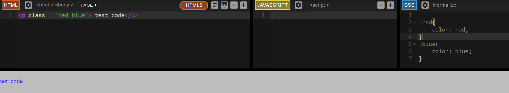

- However, if one declaration has an `!important` after it, it will override all other declarations.

## Add bootstrap into an HTML file

> [Get started with Bootstrap · Bootstrap v5.2](https://getbootstrap.com/docs/5.2/getting-started/introduction/)

The bootstrap stylesheet must go before your own stylesheet

# Useful web design website

## awwwards

Collections of layout of web design

## UI-patterns

How to solve specific design problem, like carousels.

## Dribble

Some mock-ups of other designers.

## balsamiq

A useful tool to create wireframe.

# Navbar

- Reference of Bootstrap: [Navbar · Bootstrap v5.2](https://getbootstrap.com/docs/5.2/components/navbar/)

## Make navbar displays horizontally

- Demo 1

```html
<nav class="navbar">
    <ul class="navbar-nav">
        <li class="navbar-item"><a class="nav-link" herf="">Contact</a></li>
        <li class="navbar-item"><a class="nav-link" herf="">Pricing</a></li>
        <li class="navbar-item"><a class="nav-link" herf="">Download</a></li>
    </ul>
</nav>
```

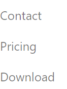

- Demo 2
  
  If we add a class navbar-expand-lg to the nav element, the navigation bar will display horizontally.

```html
<nav class="navbar navbar-expand-lg">
    <ul class="navbar-nav">
        <li class="navbar-item"><a class="nav-link" herf="">Contact</a></li>
        <li class="navbar-item"><a class="nav-link" herf="">Pricing</a></li>
        <li class="navbar-item"><a class="nav-link" herf="">Download</a></li>
    </ul>
</nav>
```

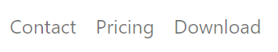

> Navbars require a wrapping `.navbar` with `.navbar-expand{-sm|-md|-lg|-xl|-xxl}` for responsive collapsing and [color scheme](https://getbootstrap.com/docs/5.2/components/navbar/#color-schemes) classes.

## Add background color to navbar

```html
<nav class="navbar navbar-expand-lg bg-light">
    <ul class="navbar-nav">
        <li class="navbar-item"><a class="nav-link" herf="">Contact</a></li>
        <li class="navbar-item"><a class="nav-link" herf="">Pricing</a></li>
        <li class="navbar-item"><a class="nav-link" herf="">Download</a></li>
    </ul>
</nav>
```

## Color scheme

> **New in v5.2.0:** Navbar theming is now powered by CSS variables and `.navbar-light` has been deprecated. CSS variables are applied to `.navbar`, defaulting to the “light” appearance, and can be overridden with `.navbar-dark`.

However, we can still used the old color scheme:

```html
<nav class="navbar navbar-expand-lg navbar-light bg-light">
    <ul class="navbar-nav">
        <li class="navbar-item"><a class="nav-link" herf="">Contact</a></li>
        <li class="navbar-item"><a class="nav-link" herf="">Pricing</a></li>
        <li class="navbar-item"><a class="nav-link" herf="">Download</a></li>
    </ul>
</nav>
```

The class `navbar-light` controls the color of the text in the navbar; The class `bg-light` controls the background color. 

```html
<nav class="navbar navbar-expand-lg navbar-light bg-primary">
```


```html
<nav class="navbar navbar-expand-lg navbar-dark bg-primary">
```


## Brand

```html
<nav class="navbar navbar-expand-lg navbar-light bg-light">
    <a class="navbar-brand" herf=""> tindog </a>
    <ul class="navbar-nav">
        <li class="navbar-item"><a class="nav-link" herf="">Contact</a></li>
        <li class="navbar-item"><a class="nav-link" herf="">Pricing</a></li>
        <li class="navbar-item"><a class="nav-link" herf="">Download</a></li>
    </ul>
</nav>
```

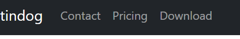

## Spacing

> [Spacing · Bootstrap v5.2](https://getbootstrap.com/docs/5.2/utilities/spacing/)

Add a utility class to the element we want it to display on the right.

```html
<nav class="navbar navbar-expand-lg navbar-light bg-light">
    <a class="navbar-brand" herf=""> tindog </a>
    <ul class="navbar-nav ms-auto">
        <li class="navbar-item"><a class="nav-link" herf="">Contact</a></li>
        <li class="navbar-item"><a class="nav-link" herf="">Pricing</a></li>
        <li class="navbar-item"><a class="nav-link" herf="">Download</a></li>
    </ul>
</nav>
```

The `ms-auto` class add an auto margin to the starting side of the left side of the element.

## Toggler

When the screen is to narrow, that the navbar can't be shown properly, then we can used the hamburger button to toggle the navbar on or off.

> [Navbar · Bootstrap v5.2](https://getbootstrap.com/docs/5.2/components/navbar/?#toggler)

- The button element:
  
  ```html
  <button
      class="navbar-toggler"
      type="button"
      data-bs-toggle="collapse"
      data-bs-target="#navbarTogglerDemo01"
      aria-controls="navbarTogglerDemo01"
      aria-expanded="false"
      aria-label="Toggle navigation"
      >
          <span class="navbar-toggler-icon"></span>
  </button>
  ```

- The div container that contains the brand and the links:
  
  ```html
  <div class="collapse navbar-collapse" id="navbarTogglerDemo01">
      <a class="navbar-brand" herf=""> tindog </a>
      <ul class="navbar-nav ms-auto">
          <li class="navbar-item"><a class="nav-link" herf="">Contact</a></li>
          <li class="navbar-item"><a class="nav-link" herf="">Pricing</a></li>
          <li class="navbar-item"><a class="nav-link" herf="">Download</a></li>
      </ul>
  </div>
  ```

The id of the collapse container should be the same as 

```css
data-bs-target="#navbarTogglerDem
```

in the button, so the button can control the area that should be hidden.

The `data-bs-target` is a CSS property that can target an element, not an invention of Bootstrap. However, Bootstrap4 used `data-target` instead.

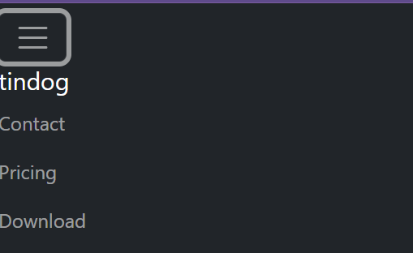

- To remain the brand on the navbar when collapsed:
  
  Move the brand element out of collapse container

```html
<nav class="navbar navbar-expand-lg navbar-dark bg-dark">
    <a class="navbar-brand" herf=""> tindog </a>
    <button
    class="navbar-toggler"
    type="button"
    data-bs-toggle="collapse"
    data-bs-target="#navbarTogglerDemo01"
    aria-controls="navbarTogglerDemo01"
    aria-expanded="false"
    aria-label="Toggle navigation"
    >
    <span class="navbar-toggler-icon"></span>
    </button>

    <div class="collapse navbar-collapse" id="navbarTogglerDemo01">
    <ul class="navbar-nav ms-auto">
        <li class="navbar-item"><a class="nav-link" herf="">Contact</a></li>
        <li class="navbar-item"><a class="nav-link" herf="">Pricing</a></li>
        <li class="navbar-item"><a class="nav-link" herf="">Download</a></li>
    </ul>
    </div>
</nav>
```

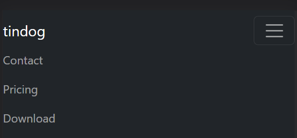

If we move the brand element after the button element, then the brand will show on the right size instead. Because in that case, the browser will render the button first.

## Fixed-top/fixed-bottom

Add the `fixed-top` class to a nav-bar, then it will stay on the top of the page when the user scrolls.

> [position - CSS&colon; Cascading Style Sheets | MDN](https://developer.mozilla.org/en-US/docs/Web/CSS/position)

# Grid System

The grid system is an implementation of CSS flex. 

## [Breakpoints · Bootstrap v5.2](https://getbootstrap.com/docs/5.2/layout/breakpoints/)

| Breakpoint        | Class infix | Dimensions |
| ----------------- |:-----------:| ---------- |
| Extra small       | *None*      | <576px     |
| Small             | `sm`        | ≥576px     |
| Medium            | `md`        | ≥768px     |
| Large             | `lg`        | ≥992px     |
| Extra large       | `xl`        | ≥1200px    |
| Extra extra large | `xxl`       | ≥1400px    |

- **Breakpoints are the building blocks of responsive design.** Use them to control when your layout can be adapted at a particular viewport or device size.
- **Mobile first, responsive design is the goal.** Bootstrap’s CSS aims to apply the bare minimum of styles to make a layout work at the smallest breakpoint, and then layers on styles to adjust that design for larger devices. This optimizes your CSS, improves rendering time, and provides a great experience for your visitors.

## Equal width

```html
<div class="row">
    <div class="col" style="background: yellow; border: solid 1px"> 1 of 2 </div>
    <div class="col" style="background: yellow; border: solid 1px"> 2 of 2 </div>
</div>
<div class="row">
    <div class="col" style="background: yellow; border: solid 1px"> 1 of 3 </div>
    <div class="col" style="background: yellow; border: solid 1px"> 2 of 3 </div>
    <div class="col" style="background: yellow; border: solid 1px"> 3 of 3 </div>
</div>
```

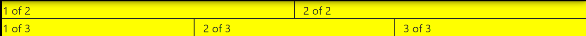

The width of the page will not affect the layout.

## Setting one column width

```html
<div class="row">
    <div class="col" style="background: yellow; border: solid 1px"> 1 of 2 </div>
    <div class="col-8" style="background: yellow; border: solid 1px"> 2 of 2 </div>
</div>
<div class="row">
    <div class="col" style="background: yellow; border: solid 1px"> 1 of 3 </div>
    <div class="col-5" style="background: yellow; border: solid 1px"> 2 of 3 </div>
    <div class="col" style="background: yellow; border: solid 1px"> 3 of 3 </div>
</div>
```

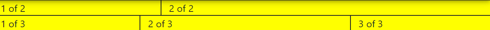

One row is divided into 12 slices. The `col` contents will auto-resize around the width designated columns.

## Variable width content

```html
<div class="container text-center">
    <div class="row justify-content-md-center">
        <div class="col col-lg-2" style="background: yellow; border: solid 1px"> 1 of 3 </div>
        <div class="col-lg-auto" style="background: yellow; border: solid 1px"> Variable width content </div>
        <div class="col col-lg-2" style="background: yellow; border: solid 1px"> 3 of 3 </div>
    </div>
    <div class="row">
        <div class="col" style="background: yellow; border: solid 1px"> 1 of 3 </div>
        <div class="col-sm-auto" style="background: yellow; border: solid 1px"> Variable width content </div>
        <div class="col col-lg-2" style="background: yellow; border: solid 1px"> 3 of 3 </div>
    </div>
</div>
```

On large page: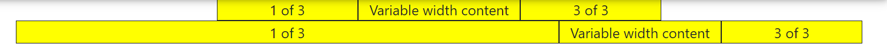

On medium page:


On small page

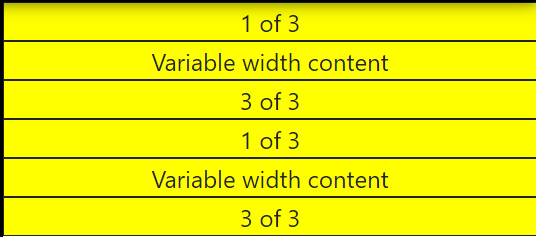

`col-{breakpoint}-auto` means size the column based on their content if the page size is bigger than {breakpoint}. If the page is smaller than {breakpoint} then it will take the whole row.

## Stacked to horizontal

`.col-sm-*` The columns will behave like a regular column `.col-*` when page is bigger than sm. But it will take a whole row when page is equal or smaller than sm.

```html
<div class="container text-center">
    <div class="row">
        <div class="col-sm-8" style="background: yellow; border: solid 1px">col-sm-8</div>
        <div class="col-sm-4" style="background: yellow; border: solid 1px">col-sm-4</div>
    </div>
    <div class="row">
        <div class="col-sm" style="background: yellow; border: solid 1px">col-sm</div>
        <div class="col-sm" style="background: yellow; border: solid 1px">col-sm</div>
        <div class="col-sm" style="background: yellow; border: solid 1px">col-sm</div>
    </div>
</div>
```

On large page:


On small page:

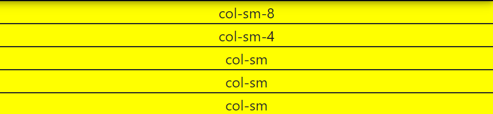

## Responsive: Mix and match

```html
<div class="container text-center">
    <!-- Stack the columns on mobile by making one full-width and the other half-width -->
    <div class="row">
        <div class="col-md-8" style="background: yellow; border: solid 1px">.col-md-8</div>
        <div class="col-6 col-md-4" style="background: yellow; border: solid 1px">.col-6 .col-md-4</div>
    </div>
    <!-- Columns start at 50% wide on mobile and bump up to 33.3% wide on desktop -->
    <div class="row">
        <div class="col-6 col-md-4" style="background: yellow; border: solid 1px">.col-6 .col-md-4</div>
        <div class="col-6 col-md-4" style="background: yellow; border: solid 1px">.col-6 .col-md-4</div>
        <div class="col-6 col-md-4" style="background: yellow; border: solid 1px">.col-6 .col-md-4</div>
    </div>
    <!-- Columns are always 50% wide, on mobile and desktop -->
    <div class="row">
        <div class="col-6" style="background: yellow; border: solid 1px">.col-6</div>
        <div class="col-6" style="background: yellow; border: solid 1px">.col-6</div>
    </div>
</div>
```

When a column has multiple classes each class has it's scope:

- For `class="col-md-8"`  col-md-8 only takes effect when page is larger than medium size. When page is smaller than medium, no other class is applicable, then the column will occupy the whole row.

- For `class="col-6 col-md-4"`  col-md-4 only takes effect when page is larger than medium size. However, when page is smaller than medium, col-6 is applicable to this column, and it will take half of the page.

- For `class="col-6 col-md-4 col-lg-3"` the column will take 1/4 of the row when page is larger than large size; will take 1/3 when page is larger than medium and smaller than large size; will take 1/2 of the row when page is smaller than medium size.

```html
<div class="row">
    <div class="col-6 col-md-4 col-lg-3" style="background: yellow; border: solid 1px">col-6 col-md-4 col-lg-3</div>
    <div class="col-6 col-md-4 col-lg-3" style="background: yellow; border: solid 1px">col-6 col-md-4 col-lg-3</div>
    <div class="col-6 col-md-4 col-lg-3" style="background: yellow; border: solid 1px">col-6 col-md-4 col-lg-3</div>
    <div class="col-6 col-md-4 col-lg-3" style="background: yellow; border: solid 1px">col-6 col-md-4 col-lg-3</div>
</div>
```

- Larger than large:
  
  
  
  Each column takes 1/4

- Larger than medium, smaller than large:
  
  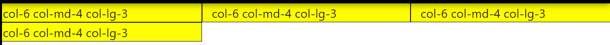
  
  Each column takes 1/3

- Smaller than medium:
  
  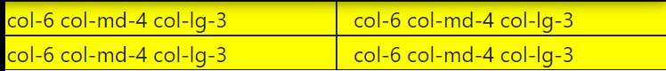
  
  Each column takes 1/2

A better approach:

```html
<div class="row">
    <div class="col-sm-6 col-md-4 col-lg-3 col-xxl-2" style="background: yellow; border: solid 1px">text</div>
    <div class="col-sm-6 col-md-4 col-lg-3 col-xxl-2" style="background: yellow; border: solid 1px">text</div>
    <div class="col-sm-6 col-md-4 col-lg-3 col-xxl-2" style="background: yellow; border: solid 1px">text</div>
    <div class="col-sm-6 col-md-4 col-lg-3 col-xxl-2" style="background: yellow; border: solid 1px">text</div>
    <div class="col-sm-6 col-md-4 col-lg-3 col-xxl-2" style="background: yellow; border: solid 1px">text</div>
    <div class="col-sm-6 col-md-4 col-lg-3 col-xxl-2" style="background: yellow; border: solid 1px">text</div>
</div>
```

# Containers

- `.container`, which sets a `max-width` at each responsive breakpoint
- `.container-{breakpoint}`, which is `width: 100%` until the specified breakpoint
- `.container-fluid`, which is `width: 100%` at all breakpoints

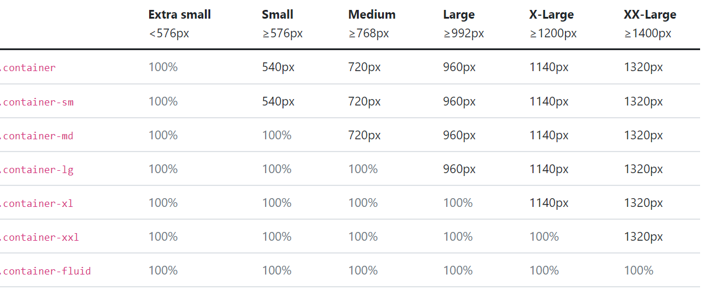

# Buttons

The `.btn` classes are designed to be used with the `<button>` element. However, you can also use these classes on `<a>` or `<input>` elements (though some browsers may apply a slightly different rendering).

## Button and colors

```html
<button type="button" class="btn btn-primary">Primary</button>
<button type="button" class="btn btn-secondary">Secondary</button>
<button type="button" class="btn btn-success">Success</button>
<button type="button" class="btn btn-danger">Danger</button>
<button type="button" class="btn btn-warning">Warning</button>
<button type="button" class="btn btn-info">Info</button>
<button type="button" class="btn btn-light">Light</button>
<button type="button" class="btn btn-dark">Dark</button>

<button type="button" class="btn btn-link">Link</button>
```

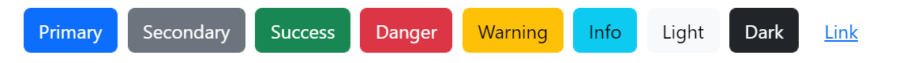

## Outline buttons

In need of a button, but not the hefty background colors they bring? Replace the default modifier classes with the `.btn-outline-*` ones to remove all background images and colors on any button.

```html
<button type="button" class="btn btn-outline-primary">Primary</button>
<button type="button" class="btn btn-outline-secondary">Secondary</button>
<button type="button" class="btn btn-outline-success">Success</button>
<button type="button" class="btn btn-outline-danger">Danger</button>
<button type="button" class="btn btn-outline-warning">Warning</button>
<button type="button" class="btn btn-outline-info">Info</button>
<button type="button" class="btn btn-outline-light">Light</button>
<button type="button" class="btn btn-outline-dark">Dark</button>
```

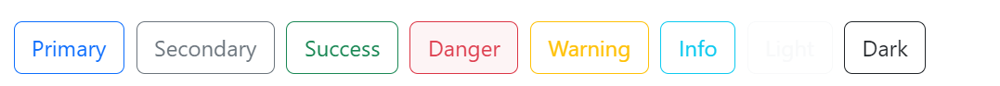

## [Sizes](https://getbootstrap.com/docs/5.2/components/buttons/#sizes)

Fancy larger or smaller buttons? Add `.btn-lg` or `.btn-sm` for additional sizes.

## Take a whole row

`w-100`

# [Font awesome](https://fontawesome.com/)

My script link:

```html
<script src="https://kit.fontawesome.com/4269c0cda1.js" crossorigin="anonymous"></script>
```

```html
<i class="fa-brands fa-apple"></i>
```

They use i tag because it's the shortest. Use a span tag is also OK.

Can use CSS font-size to adjust size or add class fa-4x (means 4em).

Font awesome styling utilities:

[Styling with Font Awesome | Font Awesome Docs](https://fontawesome.com/docs/web/style/styling)

# [Carousel](https://getbootstrap.com/docs/5.2/components/carousel/)

## Options

As options can be passed via data attributes or JavaScript, you can append an option name to `data-bs-`, as in `data-bs-animation="{value}"`.

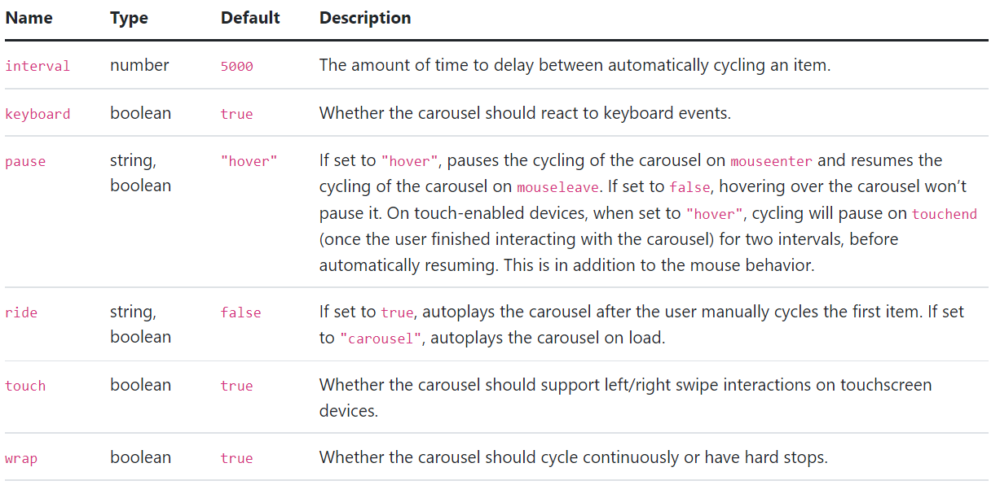

```html
<div id="carouselExampleSlidesOnly" class="carousel slide" data-bs-ride="false"> 
    <div class=" carousel-inner" style="background-color: gray">
    <div class="carousel-item active" style="background-color: blue">
        
    </div>
    <div class="carousel-item" style="background-color: yellow">
        
    </div>
    <div class="carousel-item" style="background-color: red">
        
    </div>
</div>
<button class="carousel-control-prev" type="button" data-bs-target="#carouselExampleSlidesOnly" data-bs-slide="prev">
    <span class="carousel-control-prev-icon" aria-hidden="true"></span>
    <span class="visually-hidden">Previous</span>
</button>
<button class="carousel-control-next" type="button" data-bs-target="#carouselExampleSlidesOnly" data-bs-slide="next">
    <span class="carousel-control-next-icon" aria-hidden="true"></span>
    <span class="visually-hidden">Next</span>
</button>
</div>
```

- How to move the button outside of the slide:
  
  - Delete the padding for the parent element of the carousel. Then add the same padding for the slide only. 
  
  - All the carousel object like control buttons, indicators, are relative to the inner object, so if you want to move the objects then you should change the padding of inner object.

# [Cards](https://getbootstrap.com/docs/5.2/components/card/)

## Basic usage

```html
<div class="card" style="width: 18rem;">
  
  <div class="card-body">
    <h5 class="card-title">Card title</h5>
    <p class="card-text">Some quick example text to build on the card title and make up the bulk of the card's content.</p>
    <a href="#" class="btn btn-primary">Go somewhere</a>
  </div>
</div>
```

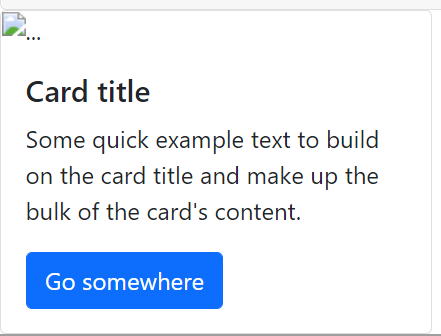

## In the page

```html
<div class="row">
        <div class="pricing-card col-lg-4 col-md-6">
          <div class="card">
            <div class="card-header">
              <h3>Chihuahua</h3>
            </div>
            <div class="card-body">
              <h2>Free</h2>
              <p>5 Matches Per Day</p>
              <p>10 Messages Per Day</p>
              <p>Unlimited App Usage</p>
              <button type="button" class="btn btn-outline-dark btn-lg w-100">
                Sign Up
              </button>
            </div>
          </div>
        </div>
        <div class="pricing-card col-lg-4 col-md-6">
          <div class="card">
            <div class="card-header">
              <h3>Labrador</h3>
            </div>
            <div class="card-body">
              <h2>$49 / mo</h2>
              <p>Unlimited Matches</p>
              <p>Unlimited Messages</p>
              <p>Unlimited App Usage</p>
              <button type="button" class="btn btn-dark btn-lg w-100">
                Sign Up
              </button>
            </div>
          </div>
        </div>

        <div class="pricing-card col-lg-4">
          <div class="card">
            <div class="card-header">
              <h3>Mastiff</h3>
            </div>
            <div class="card-body">
              <h2>$99 / mo</h2>
              <p>Pirority Listing</p>
              <p>Unlimited Matches</p>
              <p>Unlimited Messages</p>
              <p>Unlimited App Usage</p>
              <button type="button" class="btn btn-dark btn-lg w-100">
                Sign Up
              </button>
            </div>
          </div>
        </div>
      </div>
```

# [Z-index](https://developer.mozilla.org/en-US/docs/Web/CSS/z-index) and Stacking Order

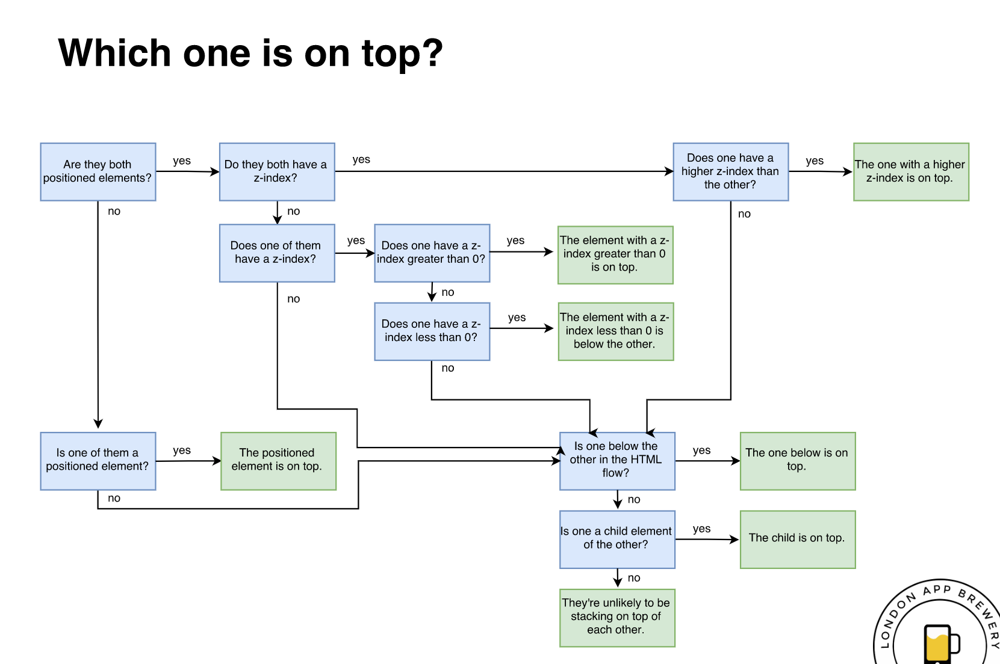

- The element with a bigger z-index will sit on top

- The positioned element will sit on top of the non-positioned element.

- The default z-index of a positioned element is 0

# Media Queries

[Responsive Web Design Media Queries](https://www.w3schools.com/css/css_rwd_mediaqueries.asp)

```css
h1{
    font-size: 30px;
}
@media (max-width: 900px) {
    h1 {
        font-size: 60px;
        color: red;
    }
}
```

The `max-width: 900px` means when the page is displayed on a screen which width is **at most 900px**, like mobile phone and tablets, then apply the styles in the bracket.

Similarly, `min-width: 900px` will apply to the screen with **at least 900px**, like laptop and desktop. 

`@media (min-width:900px) and (max-width:1000px)` will apply to the screen **between 900px and 1000px**

# Combined selectors

## Multiple selectors

```css
h2, h3, h4{
    SomeCSS: ...;
}
```

## Hierarchical selectors

```css
parent child{
    someCSS: ...;
}
.container-fluid h1{
    color: red;
}
```

The space between the parent and child is necessary.

## Combined selectors

```css
h1#title{
    someCSS:...;
}
div.container-fluid{
    someCSS:...;
}
```

No space between two selectors. The CSS in brackets will be applied to the element in both class/ID/element;

## Examples:

HTML:

```html
<div class="container">
    <h1 class="title">
        Hello world
    </h1>
</div>
<div class="container-fluid">
    <h1 class="title title2">
        Goodbye world
    </h1>
</div>
```

CSS1:

```css
.container .title{
    color: red;
}
```

CSS1 alternative:

```css
.container h1{
    color: red;
}
```

Outcome:


This is a parent-child selector. It selects a title class (or h1 element) inside a container.

CSS2:

```css
h1.title{
    color: red;
}
```

Outcome:


This is a combined selector. It selects an element that is an h1 and a title class simultaneously.

CSS3:

```css
h1.title2{
    color: red;
}
```

Outcome:

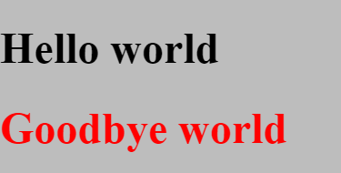

# Refactoring the Code

General principles:

> 1. Readability
> 
> 2. Modularity
> 
> 3. Efficiency
> 
> 4. Length

## Avoid redundancy

```css
h1,
h2,
h3,
h4,
h5,
h6 {
  font-family: "Montserrat", sans-serif;
  font-weight: bold;
}

h3 {
  font-size: 1.5rem;
}
h2 {
  font-size: 3rem;
  line-height: 1.5;
}
```

## Use more specific classes

Give each h2 element an individual class instead of using a generic h2 tag. So it will be easier to change styles to a specific element.

## Reuse an existing class

Each time we write `padding: 7% 15%` we can instead use a container.

## Use combined selector

Instead of create a new class.

## Do not use ID frequently

Only use ID when it will be navigated by a link.

## Only give a single custom class

And Do not use inline style

# Miscellaneous

## rotate an element

```css
.image_iphone {
  width: 60%;
  transform: rotate(20deg);
}
```

## Make image a circle

```css
.testimonial_img {
  width: 10%;
  border-radius: 50%;
  margin-bottom: 1rem;
}
```

## Target an ID in an anchor

```html
<a class="nav-link" href="#footer">Contact</a>
```

The `#footer` is an **ID** of an element in the webpage.
