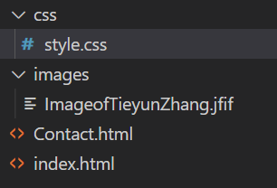
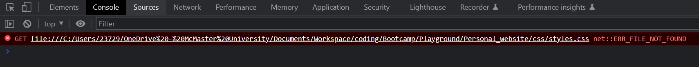
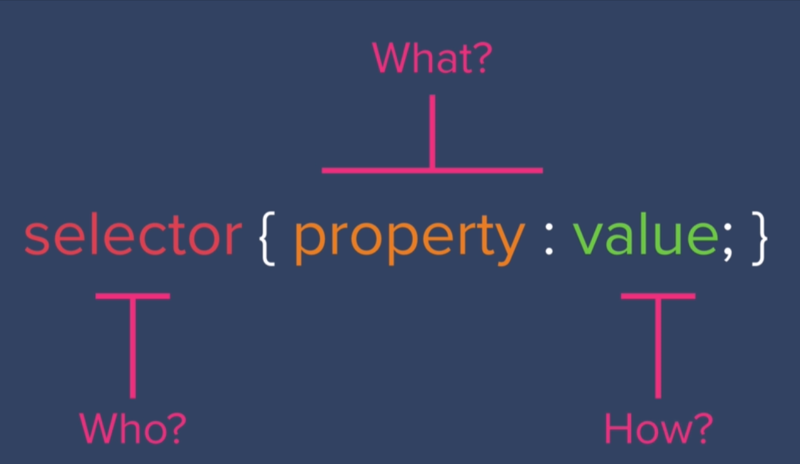
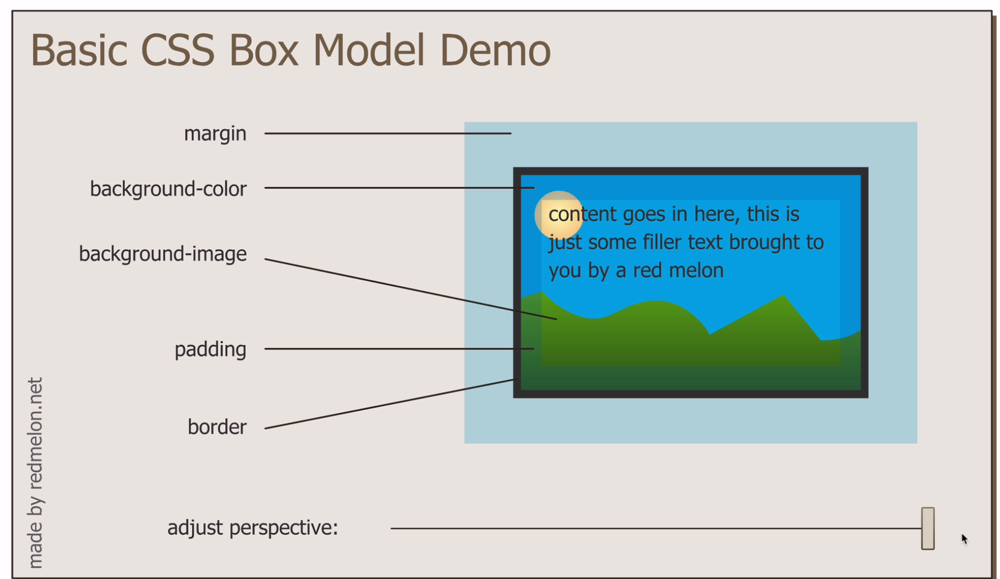
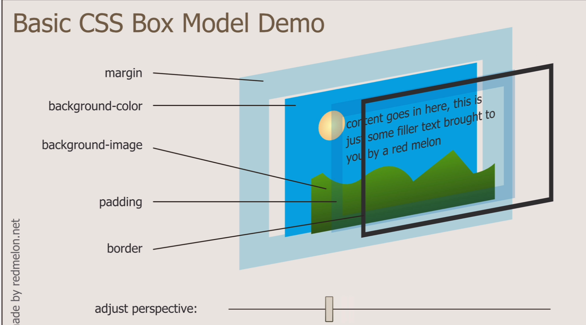
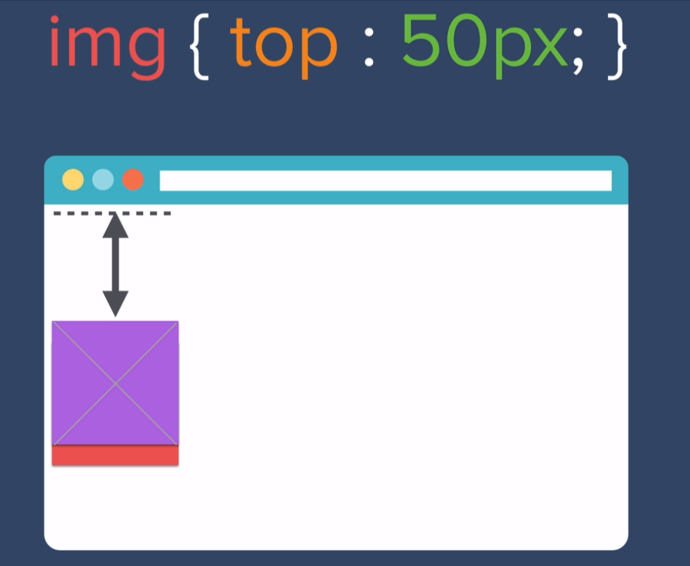
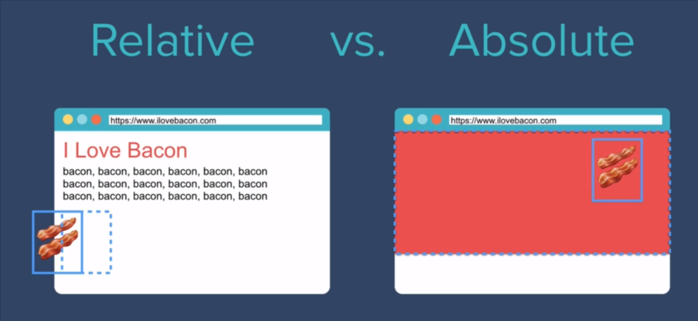

# Basic Concepts

- Stylize webpage using CSS is like decorating boxes on the page.

- 

# Inline CSS

```html
<body style="background-color: MintCream">
```

The string in the double quote followed by the style is the so-called inline CSS.

# Internal CSS

```html
<style>
  body {
    background-color: #f5f5f5;
  }
  hr {
    border-style: dotted none none;

    border-color: grey;
    height: 0px;
    border-width: 5px;
    width: 50px;
  }
</style>
```

Put the style element into the head section, then it will work.

- Stylize a horizontal line
  
  1. hr is a box
  2. We can hide the border by using `border-style: none` and then give a `height`value other than 0px, then specify the background color, then the horizontal rule will look like a very slim rectangle without a border and filled with black.
  3. another approach is to eliminate the inside part of the box and use the border to display the horizontal rule. 

The problem of internal css is that we have to add style element to each html files.

# External CSS

- Use a global CSS file so any html file can be stylized by this css.

- The folder should be something look like this:



- Each HTML should link to the CSS file:

```html
<link rel="stylesheet" href="css/style.css" />
```

- How to change Fonts:

- ```css
  h1,
  h3 {
    font-family: font1, font2, fontfamily1, fontfamliy2;
    color: aqua;
  }
  ```

- The font-family property takes multiple fonts/font families. The browser will choose from the first one until finding an available one. The last one should be a font family, to guarantee there's at least one font to fall back.

## How to use Chrome to debug

1. The Console Tag
   
   
   
   It can prompt some errors like missing files.

2. The element tag:
   
   In the styles tag, the css applied to this elements are listed in a priority order.
   
   The overwritten css rules were crossed out.
   
   - The priority of inline css, internal css, external css goes:
     
     - Inline css
     
     - Internal css
     
     - external css

# Syntax of CSS



## Selectors

- tag selectors: 
  
  ```css
  img {background: red;}
  ```
  
  selected all elements with the same tag, may cause problem in some situations 

- class selectors:
  
  ```html
  
  ```
  
  ```css
  .bacon {
    background-color: red;
  }
  ```

- ID selectors (Sparsely used)
  
  ```html
  <h1 id="heading">I Love Bacon</h1>
  ```
  
  ```css
  #heading {
    background-color: rgba(0, 255, 213, 0.514);
  }
  ```
  
  ID is **unique** for each element. We can't specify a same ID to multiple elements. 
  
  However, more than one elements can have the same class.

- One element can have more than one classes, and they must be separated by a space :
  
  ```html
  
  ```

- Pseudo-class selector
  
  ```css
  img : hover
  {
     background: red;
  }
  ```

# Favicons

```html
<link rel="icon" href="images/some_image.png" />
```

# HTML Div

Div element creates a box on the page that you can specify structure and stylize it separately from other elements.

## CSS box model

- Width and Height

- Padding

- Border

- Margin
  
  



# CSS Display Property

## display: block

- Take a whole line to display the element

- `<div>`

- The width of a block element can be changed.

## display: inline

- `<span>`

- The width of an inline element is unchangeable 

- The display property of an element can be changed forcefully by given the property of display in its css.

## display: inline-block

- It will display inline, but we can also change its width.

- an img is treated as inline-block

## display: none

- Hide the element and remove its position

- visibility: hidden
  
  - Hide the element but reserve it's original position

# CSS positioning

## position: relative

Give an element a new position by given a distance to it's original position

```css
position: relative;
left: 100px;
```

By moving elements in this way, it won't affect other elements' position. It comes as if the old position is kept, and the element is floating around it's original place.

## position: absolute

Give an element a margin relative to its closest relatively positioned parent element.



Absolute positioned elements are removed from the normal flow, and can overlap elements.

## position: fixed

Let the element stay at the same position while the user scrolling the page.

A navigation bar or side bar can use it. 

# Centering Elements

## Use `text-align: center`

- Only affect inline-block or full length block.

- A block with length specified would not be centered, however we can use auto margin:
  
  ```css
  .bottom-container {
    height: 200px;
    width: 200px;
    background-color: blue;
    margin: 0 auto;
  }
  ```

- Be careful: a property with two parameters should be split **by space**, **not comma**.

# Font

## Embedded font:

1. Find nice fonts on google fonts

2. Copy `<link>` code to the head element in the html file. This will help the browser load the font file online.

3. Specify the font using font-family property in CSS.

## Font size

```css
font-size: 90px; /**static size**/
font-size: 100%; /*16px*/
font-size: 562.5%; /*90px/16px=562.5*/
font-size: 2em; /* 16*2px */
```

16px=100%=1em

- The static font size (in pixel) wouldn't change when adjust the default font size in browser. 

- The dynamic font size (percentage, em) will change.

A child element will inherit and add up the dynamic font size from its parent element. To avoid unprecedented bugs, `rem` is recommended over `em` or percentage.

## Line-height

```css
line-height:2; 
```

use a single value to specify the line height. 2 means double the default height.

## Font-weight

**You cannot use font-{weight} to change font weight using google font anymore.** Use font-weight: 800; instead.

# CSS Floating and Clear

```css
float: left;
```

The float property make other elements wrapping around this element. "left" means this element will be placed on the left.

```css
clear: left;
```

The clear property does the opposite thing. It prevents an element from wrapping around a floating element. "left" means clear the left side.

- Using float is not recommended, use positioning instead.

# Miscellaneous

## How to make a dotted horizontal rule

```css
hr {
  width: 50px;
  margin: 100px auto;
  border: 5px dotted #eaf6f6;
  border-bottom: none;
}
```

## How to get rid of the underline of anchor link

```css
a {
  font-family: "Montserrat", sans-serif;
  color: #aebdca;
  margin: 20px;
  text-decoration: none;
}
a:hover {
  text-decoration: none;
  color: #eaf6f6;
}
```

Use a change of color while hovering instead of underline is more pleasant.
