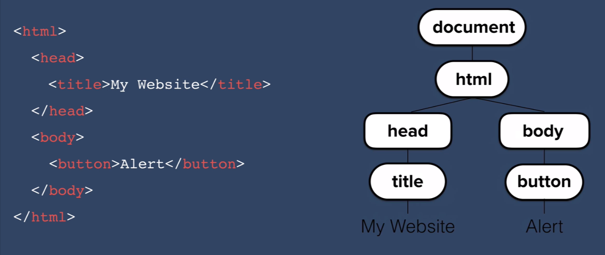
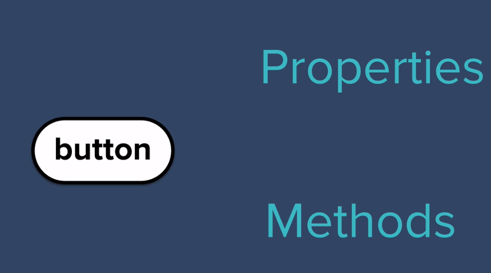
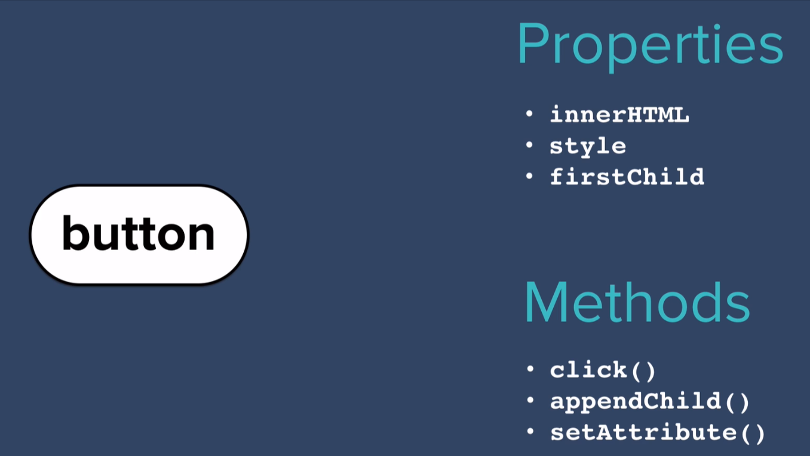

# DOM and API

[Introduction to web APIs - Learn web development | MDN](https://developer.mozilla.org/en-US/docs/Learn/JavaScript/Client-side_web_APIs/Introduction)

## What is Entry Points of API

[Introduction to web APIs - Learn web development | MDN](https://developer.mozilla.org/en-US/docs/Learn/JavaScript/Client-side_web_APIs/Introduction#they_have_recognizable_entry_points)

# Add JS to webpage

## Inline JS

```js
<body onload="alert('Hello');">
```

Use single quote in inline JS code.

Inline JS is deprecated. It has many downsides. Avoid using inline JS.

## Internal JS

```html
<body>
    <h1>Hello</h1>
    <script>
        alert("Hello");
    </script>   
</body>
```

## External JS

```html
  <body>
    <h1>Hello</h1>
    <script src="js/index.js" charset="utf-8"></script>
  </body>
```

Write the code in index.js in folder js.

## Where to put Script

Usually, we should put the script tag at the bottom of the body. This allows the browser to load the HTML elements first and then execute the JS script.

If we put the JS before the HTML code, then JS can't find the element that need to be modified and will throw an error.

# Document Object Model







DOM is an **Web API** provided by the browser, it allows Javascript to modify and control the content of the webpage, including:

- JavaScript can change all the HTML elements in the page
- JavaScript can change all the HTML attributes in the page
- JavaScript can change all the CSS styles in the page
- JavaScript can remove existing HTML elements and attributes
- JavaScript can add new HTML elements and attributes
- JavaScript can react to all existing HTML events in the page
- JavaScript can create new HTML events in the page

# DOM Methods

## Finding HTML Elements

Common ways to find an element:

- Finding HTML elements by id
- Finding HTML elements by tag name
- Finding HTML elements by class name
- Finding HTML elements by CSS selectors
- Finding HTML elements by HTML object collections

### Finding HTML elements by id

The most common way to access an HTML element is to use the `id` of the element.

```js
<html>
<body>

<p id="demo"></p>

<script>
    document.getElementById("demo").innerHTML = "Hello World!";
</script>

</body>
</html>
```

### Finding HTML Elements by Tag Name \ Class Name

```js
document.getElementsByTagName(name);
document.getElementsByClassName(name);
```

These two methods will return an array containing all the elements that have the wanted tag and class.

### Finding HTML Elements by CSS Selectors

If you want to find all HTML elements that match a specified CSS selector (id, class names, types, attributes, values of attributes, etc) i.e., the thing we put in front of the brackets, use the `querySelectorAll()` method.

```js
const x = document.querySelectorAll("p.intro");
```

This example returns a list of all `<p>` elements with `class="intro"`.

```js
const x = document.querySelector("p.intro");
```

This example returns the first `<p>` element with `class="intro"`.

The CSS Selectors are more flexible than the tag and class selectors.

## Changing HTML elements

The HTML DOM allows JavaScript to change the content of HTML elements.

### Changing HTML Content

The easiest way to modify the content of an HTML element is by using the `innerHTML` property.

```js
document.getElementById(id).innerHTML = new HTML
```

Another method is `textContent`. It will only return the pure text content, without any other elements. For example:

```html
<h1> <strong> Text </strong> </h1>
```

```js
document.querySelector("h1").innerHTML; //<strong> Text </strong>
document.querySelector("h1").textContent; //Text
```

### Changing the Value of an Attribute

- Directly change

```js
document.getElementById(id).attribute = new value
```

```html
<body>


<script>
document.getElementById("myImage").src = "landscape.jpg";
</script>

</body>
```

element.style is essentially changing the style attribute of the element.

- getAttribute

```js
let text = element.getAttribute("class");
```

- setAttribute

```js
element.setAttribute("herf", "https://www.bing.com");
```

## Changing CSS

### Directly change the property

```js
document.getElementById(id).style.property = new style
```

However, the property name is **camel cased**, different from the CSS property name.

For example:

```js
document.getElementById(id).style.fontSize = "10rem"
```

This is the same as:

```css
#id{
    font-size : 10rem;
}
```

While the property name in CSS is font-size;

The new style should be specified in form of string.

### ClassList

Another way to change the CSS is to add or remove a class of an element.

```js
const list = element.classList;
list.add("myStyle"); //Add a "myStyle" class to an element:
list.remove("myStyle"); //Remove the "myStyle" class from an element:
list.toggle("myStyle");//Toggle "myStyle" on and off:
```

## getComputedStyle

```js
getComputedStyle(element);
```

# JS Behaviors

The flowing contents are related to another function of JS: behaviors. They are based on the events of the HTML elements.

# Event Listener

[Event reference | MDN](https://developer.mozilla.org/en-US/docs/Web/Events)

```js
document.querySelector('button').addEventListener('click', handleClick);
function handleClick() {
  alert('clicked');
}
```

- The `addEventListener()` method attaches an event handler to the specified element.

- The `addEventListener()` method attaches an event handler to an element without overwriting existing event handlers.

- You can add many event handlers to one element.

- You can add many event handlers of the same type to one element, i.e two "click" events.

- You can add event listeners to any DOM object not only HTML elements. i.e the window object.

- You can easily remove an event listener by using the `removeEventListener()` method.

### Syntax

[EventTarget.addEventListener() - Web APIs | MDN](https://developer.mozilla.org/en-US/docs/Web/API/EventTarget/addEventListener#parameters)

```js
element.addEventListener(event, function, useCapture);
```

> The first parameter is the type of the event (like "`click`" or "`mousedown`" or any other [HTML DOM Event](https://www.w3schools.com/jsref/dom_obj_event.asp).)
> 
> The second parameter is the function we want to call when the event occurs.
> 
> The third parameter is a boolean value specifying whether to use event bubbling or event capturing. This parameter is optional.

```js
element.addEventListener("click", function(){ alert("Hello World!"); });
```

This example adds an anonymous function to the element.

```js
var buttons = document.querySelectorAll('button').forEach(button => button.addEventListener('click', function(){alert('I was clicked!')}));
```

This example adds an anonymous function to an Array of elements.

## Dispatch Event Manually

[EventTarget.dispatchEvent() - Web APIs | MDN](https://developer.mozilla.org/en-US/docs/Web/API/EventTarget/dispatchEvent)

```js
var buttons = document.querySelectorAll('button').forEach(
    button => button.addEventListener (
        'click', clickHandler
    )
);

document.addEventListener('keydown', function (event) {
    console.log(event.key);
    if (buttonLookupTable.hasOwnProperty(event.key)) {
        //reuse the click handler by creating a fake click event
        document.querySelector('button.' + event.key).dispatchEvent(new Event('click'));
    }
});

function clickHandler() {

    buttonAudioElements[this.innerHTML].currentTime = 0;
    buttonAudioElements[this.innerHTML].play();

    if (this.style.color === 'white') {
        this.style.removeProperty('color');
    }
    else {
        this.style.color = "white";
    }

    console.log("click event triggered by " + this.innerHTML);
}
```

## Keyboard Event

You can add a keyboard event listener to the document object, so whenever a key is pressed, the listener can be trigger.

An example:

```js
document.addEventListener('keydown', function (event) {
    console.log(event.key);
    if (buttonLookupTable.hasOwnProperty(event.key)) {
        //reuse the click handler by assigning the button as this and then calling the function
        clickHandler.call(document.querySelector('button.' + event.key));
    }
});

function clickHandler() {

    buttonAudioElements[this.innerHTML].currentTime = 0;
    buttonAudioElements[this.innerHTML].play();

    if (this.style.color === 'white') {
        this.style.removeProperty('color');
    }
    else {
        this.style.color = "white";
    }

    console.log("click event triggered by " + this.innerHTML);
}
```

## [The value of "this" within the handler](https://developer.mozilla.org/en-US/docs/Web/API/EventTarget/addEventListener#the_value_of_this_within_the_handler "Permalink to The value of "this" within the handler")

When attaching a handler function to an element using `addEventListener()`, the value of [`this`](https://developer.mozilla.org/en-US/docs/Web/JavaScript/Reference/Operators/this) inside the handler will be a reference to the element. It will be the same as the value of the `currentTarget` property of the event argument that is passed to the handler.

```js
my_element.addEventListener('click', function (e) {
  console.log(this.className)           // logs the className of my_element
  console.log(e.currentTarget === this) // logs `true`
})
```

As a reminder, [arrow functions do not have their own `this` context](https://developer.mozilla.org/en-US/docs/Web/JavaScript/Reference/Functions/Arrow_functions#no_separate_this).

```js
my_element.addEventListener('click', (e) => {
  console.log(this.className)           // WARNING: `this` is not `my_element`
  console.log(e.currentTarget === this) // logs `false`
})
```

```js
var buttonLookupTable = { j: "crash", k: "kick-bass", l: "snare", w: "tom-1", a: "tom-2", s: "tom-3", d: "tom-4" };

var buttonAudioElements = {};
for (var key in buttonLookupTable) { 
    //pre load the audio elements
    var audio = new Audio('sounds/' + buttonLookupTable[key] + '.mp3');
    buttonAudioElements[key] = audio;
}

var buttons = document.querySelectorAll('button').forEach(addEventListenerToButtons);

function addEventListenerToButtons(button) {
    var clickHandler = function () {
        //Should set the current time to 0, or else the sound will not play if it is already playing
        buttonAudioElements[button.innerHTML].currentTime = 0;
        //get the audio element from the lookup table and play it
        buttonAudioElements[button.innerHTML].play();
        //toggle the color of the button
        if (this.style.color === 'white') {
            this.style.removeProperty('color');
        }
        else {
            this.style.color = "white";
        }
    }
    button.addEventListener('click', clickHandler);
}
```

This is an example of adding event listener to a drum button.

# [HTMLMediaElement - Web APIs | MDN](https://developer.mozilla.org/en-US/docs/Web/API/HTMLMediaElement)

This is a part of the HTML DOM API.

The **`HTMLMediaElement`** interface adds to [`HTMLElement`](https://developer.mozilla.org/en-US/docs/Web/API/HTMLElement) the properties and methods needed to support basic media-related capabilities that are common to audio and video.

Example:

```js
function clickHandler() {
    var audio = new Audio('sounds/tom-1.mp3');
    audio.play();
}
```

Audio is an HTML audio element, and it's equivalent to:

```html
<audio preload="auto" src="sounds/tom-1.mp3"></audio>
```

But, in JS and HTML DOM API, it's an Javascript object "HTML audio element" at the same time. 
