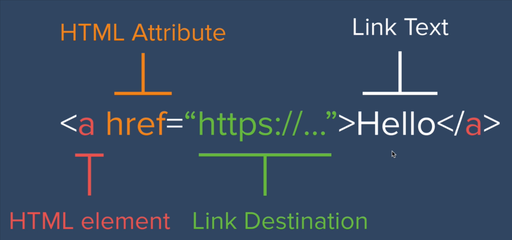

# HTML Elements

## Closing tag

1. level 1 heading
   
   ```html
   <h1> This is a level 1 heading created using the h1 tag </h1>
   ```

2. All headings include `<h1> </h1>` to  `<h6> </h6>`

3. `<meta charset="utf-8">`

4. `<ul>` unordered list.
   
   1. `<li>` list item

## Self closing tag

1. `<br>` produces a line break in the text

2. `<hr>` creates a horizontal line

# HTML Attributes

## Anatomy of HTML tag

1. `<hr size="3" noshade>`
   
   1. size = "3", should use string to specify the value of the attribute

# HTML Miscellany

## How to comment

```html
<!-- Here are some comments -->
```

## boilerplate

## meta element

### Definition and Usage

The `<meta>` tag defines metadata about an HTML document. Metadata is data (information) about data.

`<meta>` tags always go inside the <head> element, and are typically used to specify character set, page description, keywords, author of the document, and viewport settings.

Metadata will not be displayed on the page, but is machine parsable.

Metadata is used by browsers (how to display content or reload page), search engines (keywords), and other web services.

There is a method to let web designers take control over the viewport (the user's visible area of a web page), through the `<meta>` tag (See "Setting The Viewport" example below).

**Define keywords for search engines:**

<meta name="keywords" content="HTML, CSS, JavaScript">

**Define a description of your web page:**

<meta name="description" content="Free Web tutorials for HTML and CSS">

**Define the author of a page:**

<meta name="author" content="John Doe">

**Refresh document every 30 seconds:**

<meta http-equiv="refresh" content="30">

**Setting the viewport to make your website look good on all devices:**

<meta name="viewport" content="width=device-width, initial-scale=1.0">

## Disambiguation of similar elements

### `<em>` and `<i>`, `<strong>`and`<b>`

Both `<i>` and `<b>` are doing decoration things. `<i>` makes the text italic and `<b>` bolds the text. However `<em>`(abbreviation for emphasize) conveys more information. It tells the browser to emphasize the text, which the default effect will be italicization the text. We can adjust the effect of `<em>` using css. 

When we write HTML, we focus on the structure rather than the style. We use CSS to do that.

## Char encoding

Unicode: Encoding everything into a up to 21 bit container.

- UTF-8:
  
  - **Variable-length** encoding scheme
  
  - 
    
    UTF-8 uses the most significant bit to signal whether there is a multi-bit unicode character. X in the chart is the variable bit to store a unicode char. One byte utf-8 char have 7 bits to store the code point, and the 4 bytes utf-8 char have 21 bits.
    
    > ```
    > The table below summarizes the format of these different octet types.
    >    The letter x indicates bits available for encoding bits of the
    >    character number.
    > 
    >    Char. number range  |        UTF-8 octet sequence
    >       (hexadecimal)    |              (binary)
    >    --------------------+---------------------------------------------
    >    0000 0000-0000 007F | 0xxxxxxx
    >    0000 0080-0000 07FF | 110xxxxx 10xxxxxx
    >    0000 0800-0000 FFFF | 1110xxxx 10xxxxxx 10xxxxxx
    >    0001 0000-0010 FFFF | 11110xxx 10xxxxxx 10xxxxxx 10xxxxxx
    > 
    >    Encoding a character to UTF-8 proceeds as follows:
    > 
    >    1.  Determine the number of octets required from the character number
    >        and the first column of the table above.  It is important to note
    >        that the rows of the table are mutually exclusive, i.e., there is
    >        only one valid way to encode a given character.
    > 
    >    2.  Prepare the high-order bits of the octets as per the second
    >        column of the table.
    > 
    >    3.  Fill in the bits marked x from the bits of the character number,
    >        expressed in binary.  Start by putting the lowest-order bit of
    >        the character number in the lowest-order position of the last
    >        octet of the sequence, then put the next higher-order bit of the
    >        character number in the next higher-order position of that octet,
    >        etc.  When the x bits of the last octet are filled in, move on to
    >        the next to last octet, then to the preceding one, etc. until all
    >        x bits are filled in.
    > ```
    > 
    > https://www.ietf.org/rfc/rfc3629.txt

## Images

```html

```

## Anchor tag



The link destination can be another HTML file within the website folder.

**Each page should start from the boilerplate!**

## table

- `<table>`

- `<tr>`table row

- `<td>`table data(cell)
  
  - ```html
    <table border="1">
          <thead>
            <tr>
              <th>Year</th>
              <th>Course</th>
            </tr>
          </thead>
          <tr>
            <td>2018-2022</td>
            <td>Bachelor of Engineering in Automation</td>
          </tr>
          <thead>
            <!-- the thead is intentionally copied -->
            <tr>
              <th>Year</th>
              <th>Course</th>
            </tr>
          </thead>
          <tr>
            <td>2022-2023</td>
            <td>Master of Engineering in Computing and Software</td>
          </tr>
        </table>
    ```
  
  - 

- `<thead>`
  
  - `<th> ` table head cell
  
  - ```html
    <thead>
        <tr>
            <th>Year</th>
            <th>Course</th>
        </tr>
    </thead>
    ```

- `<tbody>`

- `<tfoot>`

Do not use attributes like border, color of table. This is the job of CSS.

- Nested Table
  
  ```html
  <table border="2">
    <tr>
      <td>
        <table>
          <tr>
            <td>Algorithms</td>
            <td>🌟🌟🌟⭐⭐</td>
          </tr>
          <tr>
            <td>C++ Basics</td>
            <td>🌟🌟🌟⭐⭐</td>
          </tr>
        </table>
      </td>
      <td>
        <table>
          <tr>
            <td>Some Other Stuff</td>
            <td>🌟🌟🌟⭐⭐</td>
          </tr>
          <tr>
            <td>Some Cool Stuff</td>
            <td>🌟🌟🌟⭐⭐</td>
          </tr>
        </table>
      </td>
    </tr>
  </table>
  ```

- How to organize a table using tags
  
  - ```html
    <table>
        <thead>
            <tr>
                <th>Items</th>
                <th scope="col">Expenditure</th>
            </tr>
        </thead>
        <tbody>
            <tr>
                <th scope="row">Donuts</th>
                <td>3,000</td>
            </tr>
            <tr>
                <th scope="row">Stationery</th>
                <td>18,000</td>
            </tr>
        </tbody>
        <tfoot>
            <tr>
                <th scope="row">Totals</th>
                <td>21,000</td>
            </tr>
        </tfoot>
    </table>
    ```

## Form

A kind of technique to collect response from the web user

- The Form element
  
  ```html
  <form action="somepage.html" method="post">
  ```
  
  When you click submit the form will be handed to somepage.html

- The Label element
  
  ```html
  <label for="username">Please Enter Your Name</label>
  ```

- The Input Element
  
  ```html
  <input type="text" id="username" name="username" />
  ```

        The `id name value` attribute is optional

- Some examples of type:
  
  - ```
    Type    Description    Basic Examples
    
    button    A push button with no default behavior displaying the value of the value attribute, empty by default.    
    
    checkbox    A check box allowing single values to be selected/deselected.    
    
    color    A control for specifying a color; opening a color picker when active in supporting browsers.    
    
    date    A control for entering a date (year, month, and day, with no time). Opens a date picker or numeric wheels for year, month, day when active in supporting browsers.    
    
    datetime-local    A control for entering a date and time, with no time zone. Opens a date picker or numeric wheels for date- and time-components when active in supporting browsers.    
    
    email    A field for editing an email address. Looks like a text input, but has validation parameters and relevant keyboard in supporting browsers and devices with dynamic keyboards.    
    
    file    A control that lets the user select a file. Use the accept attribute to define the types of files that the control can select.
    ```
  
  - 
