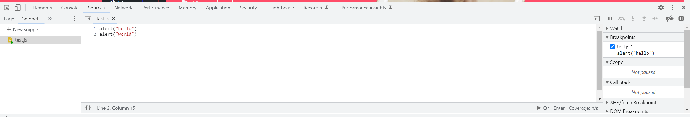

# What is JS

Javascript itself is simply a plain script language. However, JS usually comes with a bunch of APIs which makes JS powerful. The API allows developers to use JS to interact with other entities like the browser (Web API DOM), and backend servers (Node.js APIs). 

# Run Js snippets in Chrome



# Data Types

## Strings

`"Strings"`

## Numbers

`123`

## Boolean

`true` `false`

## typeof()

return the data type

# Variables

## Declare a variable

```java
var greet = "Hello " // global variable

function myfunction(){
    var msg = "JavaScript!"; 
    alert(greet + msg); //can access global and local variable
}

myfunction();

alert(greet);//can access global variable
alert(msg); //error: can't access local variable
```

- Declare Variables without the var Keyword
  
  Must assign a value to this variable. 

```js
function myfunction(){
    msg = "Hello JavaScript!"; 
}
myfunction();
alert(msg); // msg becomes global variable so can be accessed here
```

# Naming conventions

The rules are the same as C++ and JAVA.

# String

## Concatenation

Same as Java. Use `+`

## Length

```js
a = "this is a string"
console.log(a.length)
```

Output:

```text
16
```

## Slice

```js
slice(start) //One parameter
slice(start, end)
```

```js
a = "this is a string"
console.log(a.slice(0,4))
console.log(a.slice(2))
```

Output

```textile
thi
is is a string
```

## toUpperCase()/LowerCase()

Change a string to all uppercase or lowercase

Example: 

Capitalize the 1st character of a string

```js
var name = prompt('your name');
name = name.slice(0,1).toUpperCase()+name.slice(1).toLowerCase();
```

# Function

[JavaScript Function Parameters](https://www.w3schools.com/js/js_function_parameters.asp)

# Math class

```js
Math.floor(1.4);//==1
```

# Random Generator

```js
Math.
```

# If-else

```js
if (condition1) {
  //  block of code to be executed if condition1 is true
} else if (condition2) {
  //  block of code to be executed if the condition1 is false and condition2 is true
} else {
  //  block of code to be executed if the condition1 is false and condition2 is false
}
```

# Comparators and Equality

The == and != operators in javascript are used to compare two values. The == operator checks if two values are *equal*. The != operator checks if two values are *not equal*. It is also known as the *loose equality* operator because it checks **abstract equality**, i.e., it tends to convert the data types of operands in order to carry the comparison when two operands aren't of the same data type.

The === operator is called **strict equality** operator (and !== is called strictly inequality operator). The === operators follow **Strictly equality comparison algorithm**, i.e., it doesn't do the type conversion of the operands before comparing their values and returns false even if the data type of the operands aren't the same.

# Variable Scope

[JavaScript Scope](https://www.w3schools.com/js/js_scope.asp)

## Block Scope

```js
{
  let x = 2;
}
// x can NOT be used here
{
  var x = 2;
}
// x CAN be used here
```

## Local Scope

Variables declared within a JavaScript function, become **LOCAL** to the function.

```js
// code here can NOT use carName

function myFunction() {
  let carName = "Volvo";
  // code here CAN use carName
}

// code here can NOT use carName
```

## Function Scope

Variables declared with `var`, `let` and `const` are quite similar when declared inside a function. They all have **Function Scope**:

```js
function myFunction() {
  var carName = "Volvo";   // Function Scope
}
function myFunction() {
  let carName = "Volvo";   // Function Scope
}
function myFunction() {
  const carName = "Volvo";   // Function Scope
}
```

## Global Scope

A variable declared outside a function, becomes **GLOBAL**.

Variables declared with `var`, `let` and `const` are quite similar when declared outside a block.

```js
let carName = "Volvo";
// code here can use carName
const x = 2;       // Global scope
var x = 2;       // Global scope

function myFunction() {
// code here can also use carName
}
```

## Automatically Global

If you assign a value to a variable that has not been declared, it will automatically become a **GLOBAL** variable.

```js
myFunction();

// code here can use carName

function myFunction() {
  carName = "Volvo";
}
```

# Array

```js
const person = ["John", "Doe", 46];
person.includes("John"); // true
```

The Js array can hold different types of objects.

## Array methods

[JavaScript Array Methods](https://www.w3schools.com/js/js_array_methods.asp)

```js
a = new Array(100);
a.length; //=100
a.push('new'); //a.length == 101;
```

## Array const

```js
// You can create a constant array:
const cars = ["Saab", "Volvo", "BMW"];

// You can change an element:
cars[0] = "Toyota";

// You can add an element:
cars.push("Audi");
```

```js
const cars = ["Saab", "Volvo", "BMW"];
cars = ["Toyota", "Volvo", "Audi"];    // ERROR
```

The keyword `const` is a little misleading.

It does NOT define a constant array. It defines a constant reference to an array.

Because of this, we can still change the elements of a constant array.

# for-in for-of loop

## for-in

for-in loop gives an iterative index of an object.

```js
const person = {fname:"John", lname:"Doe", age:25};

let text = "";
for (let x in person) {
  text += person[x];
}
```

- The **for in** loop iterates over a **person** object
- Each iteration returns a **key** (x), like fname, lname, age
- The key is used to access the **value** of the key, like "John", lname, age
- The value of the key is **person[x]**

```js
const numbers = [45, 4, 9, 16, 25];

let txt = "";
for (let x in numbers) {
  txt += numbers[x];
}
```

Do not use **for in** over an Array if the index **order** is important.

The index order is implementation-dependent, and array values may not be accessed in the order you expect.

It is better to use a **for** loop, a **for of** loop, or **Array.forEach()** when the order is important.

## for-of

```js
const cars = ["BMW", "Volvo", "Mini"];

let text = "";
for (let x of cars) {
  text += x;
}
```

Each time x will be one element in the cars array.

```js
let language = "JavaScript";

let text = "";
for (let x of language) {
text += x;
}
```

Each time x will be one character in the language string.

## Foreach (Array)

```js
// Arrow function
forEach((element) => { /* … */ })
forEach((element, index) => { /* … */ })
forEach((element, index, array) => { /* … */ })

// Callback function
forEach(callbackFn)
forEach(callbackFn, thisArg)

// Inline callback function
forEach(function(element) { /* … */ })
forEach(function(element, index) { /* … */ })
forEach(function(element, index, array){ /* … */ })
forEach(function(element, index, array) { /* … */ }, thisArg)
```

# [Arrow function](https://developer.mozilla.org/en-US/docs/Web/JavaScript/Reference/Functions/Arrow_functions)

Syntax:

```js
param => expression

(param) => expression

(param1, paramN) => expression

param => {
  statements
}

(param1, paramN) => {
  statements
}
```

Explanation:

```js
// Traditional anonymous function
(function (a) {
  return a + 100;
});

// 1. Remove the word "function" and place arrow between the argument and opening body bracket
(a) => {
  return a + 100;
};

// 2. Remove the body braces and word "return" — the return is implied.
(a) => a + 100;

// 3. Remove the parameter parentheses
a => a + 100;
```

```js
// Traditional anonymous function
(function (a, b) {
  const chuck = 42;
  return a + b + chuck;
});

// Arrow function
(a, b) => {
  const chuck = 42;
  return a + b + chuck;
};
```

# Higher Order Functions

```js
function add(num1, num2) {
return num1 + num2;
}

function subtract(num1, num2) {
return num1 - num2;
}

function multiply(num1, num2) {
return num1 * num2;
}

function divide(num1, num2) {
return num1 / num2;
}

function calculator(num1, num2, operator) {
return operator(num1, num2);
}
```

# Object

## Terminologies

The **name:values** pairs in JavaScript objects are called **properties**:

| Property  | Property Value |
| --------- | -------------- |
| firstName | John           |
| lastName  | Doe            |
| age       | 50             |
| eyeColor  | blue           |

You can access object properties in two ways:

`objectName.propertyName`

or

`objectName["propertyName"]`

## Methods in Objects

```js
const person = {
  firstName: "John",
  lastName: "Doe",
  id: 5566,
  fullName: function() {
    return this.firstName + " " + this.lastName;
  }
};
```

# Constructor

[JavaScript Constructors](https://www.w3schools.com/js/js_object_constructors.asp)

## What is **this**?

[JavaScript this](https://www.w3schools.com/js/js_this.asp)

In JavaScript, the `this` keyword refers to an **object**.

**Which** object depends on how `this` is being invoked (used or called).

The `this` keyword refers to different objects depending on how it is used:

| In an object method, `this` refers to the **object**.                              |
| ---------------------------------------------------------------------------------- |
| Alone, `this` refers to the **global object**.                                     |
| In a function, `this` refers to the **global object**.                             |
| In a function, in strict mode, `this` is `undefined`.                              |
| In an event, `this` refers to the **element** that received the event.             |
| Methods like `call()`, `apply()`, and `bind()` can refer `this` to **any object**. |

## Binding `this` explicitly

### bind()

[Function.prototype.bind() - JavaScript | MDN](https://developer.mozilla.org/en-US/docs/Web/JavaScript/Reference/Global_objects/Function/bind)

```js
bind(thisArg)
bind(thisArg, arg1)
bind(thisArg, arg1, arg2)
bind(thisArg, arg1, arg2, /* …, */ argN)
```

```js
function log(...args) {
  "use strict"; // prevent `this` from being boxed into the wrapper object
  console.log(this, ...args);
};
const boundLog = log.bind("this value", 1, 2);
const boundLog2 = boundLog.bind("new this value", 3, 4);
boundLog2(5, 6); // "this value", 1, 2, 3, 4, 5, 6
```

### call()

[Function.prototype.call() - JavaScript | MDN](https://developer.mozilla.org/en-US/docs/Web/JavaScript/Reference/Global_Objects/Function/call)

```js
call()
call(thisArg)
call(thisArg, arg1, /* …, */ argN)
```

```js
function Product(name, price) {
  this.name = name;
  this.price = price;
}

function Food(name, price) {
  Product.call(this, name, price);
  this.category = 'food';
}

function Toy(name, price) {
  Product.call(this, name, price);
  this.category = 'toy';
}

const cheese = new Food('feta', 5);
const fun = new Toy('robot', 40);
```

### apply()

```js
apply(thisArg)
apply(thisArg, argsArray)
```

 This function is almost identical to [`call()`](https://developer.mozilla.org/en-US/docs/Web/JavaScript/Reference/Global_Objects/Function/call), except that `call()` accepts an **argument list**, while `apply()` accepts a **single array of arguments** — for example, `func.apply(this, ['eat', 'bananas'])` vs. `func.call(this, 'eat', 'bananas')`.

### disambiguation

`call()`/`apply()` call the function immediately, whereas `bind` returns a function that, when later executed, will have the correct context set for calling the original function.

## Constructor and new keyword

```js
function foo(bar1, bar2) {
    this.newProperty1 = bar1;
    this.newProperty2 = bar2;
    this.newProperty3 = "foo";
}
```

For the foo function, if it's executed as:

```js
foo("bar1","bar2");
```

Then it will add three properties (newProperty1,newProperty2,newProperty3), to the **global object**;

However, if we add the keyword `new` before the function:

```js
new foo("bar1","bar2");
```

Then, it will:

> 1. Create a new object
> 2. Set the prototype of this object to the constructor function's prototype property
> 3. Bind the `this` keyword to the newly created object and executes the constructor function
> 4. Return the newly created object

So the `this` in the function will be a new created object and it will no longer add properties to the global object.

## Build a constructor

```js
function Person(first, last, age, eye) {
  this.firstName = first;
  this.lastName = last;
  this.age = age;
  this.eyeColor = eye;
}
```

It's a good habit to capitalize the 1st character of the constructor's name. (Although not mandatory.)

When the constructor is called with a keyword new:

```js
const myFather = new Person("John", "Doe", 50, "blue");
const myMother = new Person("Sally", "Rally", 48, "green");
```

It will create a new object and add the properties to the newly created object and return it.

# Prototype

When you try to access a property of an object: if the property can't be found in the object itself, the prototype is searched for the property. If the property still can't be found, then the prototype's prototype is searched, and so on until either the property is found, or the end of the chain is reached, in which case `undefined` is returned.

[Object prototypes - Learn web development | MDN](https://developer.mozilla.org/en-US/docs/Learn/JavaScript/Objects/Object_prototypes)

Examples:

Add a new property to an existing constructor:

```js
function Person(first, last, age, eyecolor) {
  this.firstName = first;
  this.lastName = last;
  this.age = age;
  this.eyeColor = eyecolor;
}
var person1 = new Person("foo","foo",100,"yellow");
Person.prototype.nationality = "English";
console.log(person1.nationality); //"English"
```

Person is the prototype of person1. Then we add a new property nationality to the prototype. And the person1 will also have this newly added property.

## Get prototype

In the example above, `Person.prototype` is only applicable to constructor function. 

[Function.prototype.prototype - JavaScript | MDN](https://developer.mozilla.org/en-US/docs/Web/JavaScript/Reference/Global_Objects/Function/prototype)

To get the prototype of an arbitrary object, you should use Object.getPrototypeOf() instead.

Example:

```js
const prototype1 = {};
const object1 = Object.create(prototype1);

console.log(Object.getPrototypeOf(object1) === prototype1);
// expected output: true
```

A deprecated method is: `object.__proto__`

## Prototype and constructor

[Inheritance and the prototype chain - JavaScript | MDN](https://developer.mozilla.org/en-US/docs/Web/JavaScript/Inheritance_and_the_prototype_chain)

```js
// A constructor function
function Box(value) {
  this.value = value;
}

// Properties all boxes created from the Box() constructor
// will have
Box.prototype.getValue = function () {
  return this.value;
};

const boxes = [
  new Box(1),
  new Box(2),
  new Box(3),
];
```

We say that `new Box(1)` is an *instance* created from the `Box` constructor function. `Box.prototype` is just a plain object. Every instance created from a constructor function will automatically have the constructor's [`prototype`](https://developer.mozilla.org/en-US/docs/Web/JavaScript/Reference/Global_Objects/Function/prototype) property as its `[[Prototype]]` — that is, `Object.getPrototypeOf(new Box()) === Box.prototype`. `Constructor.prototype` by default has one own property: [`constructor`](https://developer.mozilla.org/en-US/docs/Web/JavaScript/Reference/Global_Objects/Object/constructor), which references the constructor function itself — that is, `Box.prototype.constructor === Box`. This allows one to access the original constructor from any instance.

When a function is called with [`new`](https://developer.mozilla.org/en-US/docs/Web/JavaScript/Reference/Operators/new), the constructor's `prototype` property will become the resulting object's prototype.

```js
function Ctor() {}
const inst = new Ctor();
console.log(Object.getPrototypeOf(inst) === Ctor.prototype); // true
```

# Asynchronous

## Timeout

```js
setTimeout(function() { myFunction("I love You !!!"); }, 3000);

function myFunction(value) {
  document.getElementById("demo").innerHTML = value;
}
```

## Repeat

```js
setInterval(myFunction, 1000);

function myFunction() {
  let d = new Date();
  document.getElementById("demo").innerHTML=
  d.getHours() + ":" +
  d.getMinutes() + ":" +
  d.getSeconds();
}
```

## Callback

See in the DOM.md

## Promises

Promises are the ideal choice for handling asynchronous operations in the simplest manner. They can handle multiple asynchronous operations easily and **provide better error handling than callbacks and events**.

https://blog.loginradius.com/engineering/callback-vs-promises-vs-async-await/

## Async

[Asynchronous JavaScript - Learn web development | MDN](https://developer.mozilla.org/en-US/docs/Learn/JavaScript/Asynchronous)

What we need is a way for our program to:

1. Start a long-running operation by calling a function.
2. Have that function start the operation and return immediately, so that our program can still be responsive to other events.
3. Notify us with the result of the operation when it eventually completes.

That's precisely what asynchronous functions can do. The rest of this module explains how they are implemented in JavaScript.

## Promise

[How to use promises - Learn web development | MDN](https://developer.mozilla.org/en-US/docs/Learn/JavaScript/Asynchronous/Promises)

With a promise-based API, the asynchronous function starts the operation and returns a [`Promise`](https://developer.mozilla.org/en-US/docs/Web/JavaScript/Reference/Global_Objects/Promise) object. You can then attach handlers to this promise object, and these handlers will be executed when the operation has succeeded or failed.

```js
const fetchPromise = fetch('https://mdn.github.io/learning-area/javascript/apis/fetching-data/can-store/products.json');

fetchPromise.then((response) => {
  const jsonPromise = response.json();
  jsonPromise.then((data) => {
    console.log(data[0].name);
  });
});
```

Chaining promise

```js
const fetchPromise = fetch('bad-scheme://mdn.github.io/learning-area/javascript/apis/fetching-data/can-store/products.json');

fetchPromise
  .then((response) => {
    if (!response.ok) {
      throw new Error(`HTTP error: ${response.status}`);
    }
    return response.json();
  })
  .then((data) => {
    console.log(data[0].name);
  })
  .catch((error) => {
    console.error(`Could not get products: ${error}`);
  });
```

## Async and Await

Inside an async function, you can use the `await` keyword before a call to a function that returns a promise. This makes the code wait at that point until the promise is settled, at which point the fulfilled value of the promise is treated as a return value, or the rejected value is thrown.

This enables you to write code that uses asynchronous functions but looks like synchronous code. For example, we could use it to rewrite our fetch example:

```js
async function fetchProducts() {
  try {
    const response = await fetch('https://mdn.github.io/learning-area/javascript/apis/fetching-data/can-store/products.json');
    if (!response.ok) {
      throw new Error(`HTTP error: ${response.status}`);
    }
    const data = await response.json();
    return data;
  }
  catch (error) {
    console.error(`Could not get products: ${error}`);
  }
}

const promise = fetchProducts();
promise.then((data) => console.log(data[0].name));
```

## Then

If you want to execute the code in .then after the promise is resolved, then you have to parse a function with one input to .then:

```js
async function someFunc(){
    await resolveAfter2sec();
    return 'resolved'.
}

someFunc(console.log('hello'));  //will log hello immediately
someFunc(e=>console.log('hello'));//will log hello after 2 sec.
```

## DO NOT MIX async/await with .then/.catch

https://www.theodinproject.com/lessons/node-path-javascript-async-and-await

[A Comparison Of async/await Versus then/catch — Smashing Magazine](https://www.smashingmagazine.com/2020/11/comparison-async-await-versus-then-catch/)
